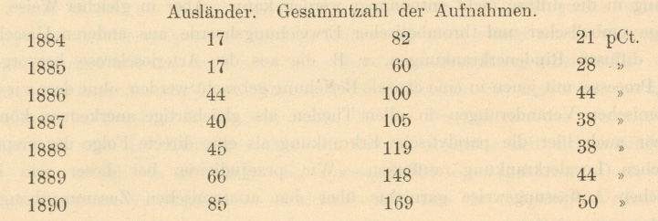
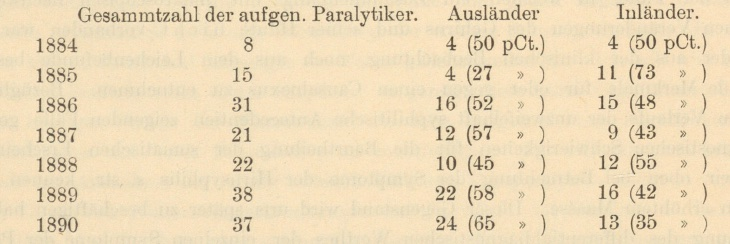
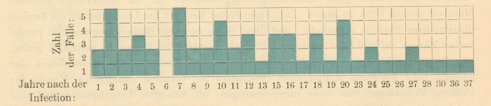
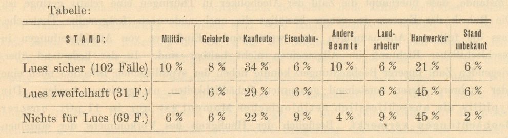
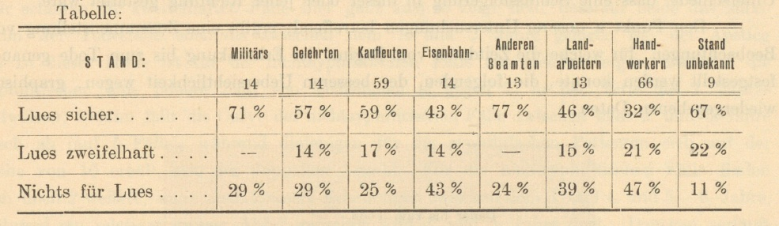
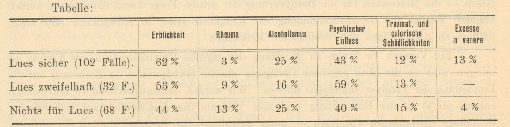
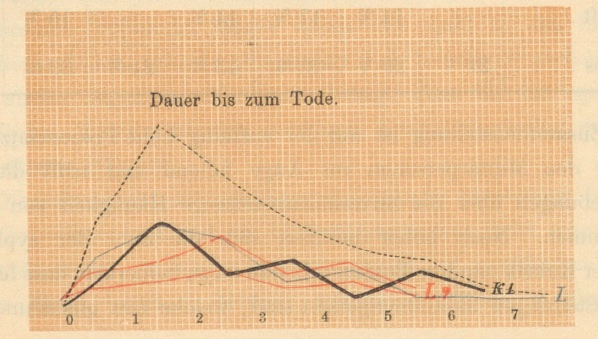
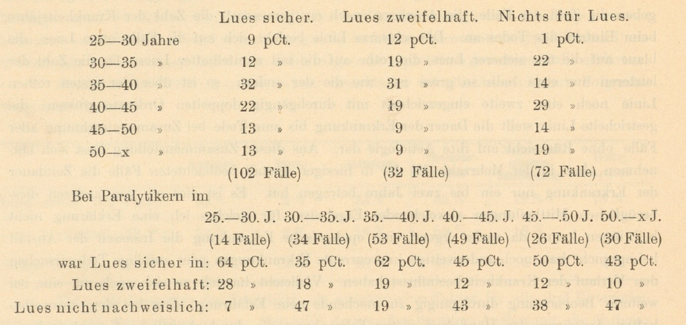
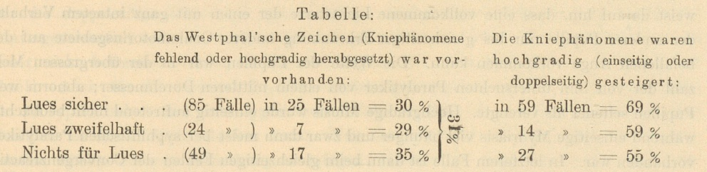
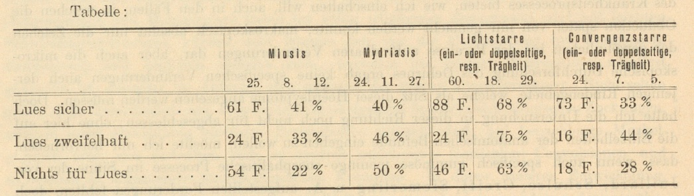

# Hirnsyphilis und Dementia paralytica: Klinische und statistische Untersuchungen

von

*Prof. Dr. O. Binswanger* in Jena.

<!---
See README.md file for advice on editing.
-->

Die neueren Bearbeiter der syphilitischen Erkrankungen des Centraluervensystems-
ich nenne vor Allen Rumpf, Strümpell, Gowers — haben auch die allgemeine progressive
Paralyse der Irren in den Kreis ihrer Betrachtungen hineingezogen. Abgesehen von den
später zu erwähnenden statistischen Angaben über die Häufigkeit des Vorkommens syphilitischer
Infection bei paralytischen Geisteskranken, ist von den oben genannten Autoren der Versuch
unternormen worden, bestimmte Theorien über den ursächlichen Zusammenhang dieser
organischen Gehirnerkrankung mit der stattgehabten syphilitischen Infection aufzustellen,
welche theils auf allgemeine pathologische Erwägungen, theils auf pathologisch-anatomische
Untersuchungen gegründet sind. Rumpf, welcher die auatomischen Veränderungen des
Gehirns bei drei syphilitisch gewesenen Paralytikern sorgfältigen Untersuchungen unterzogen
hat, — Untersuchungen, welchen wir späterhin wieder begegnen werden — tritt für einen
innigen, wenn auch nicht ausschliesslichen Zusammenhang zwischen der früher stattgehabten
syphilitischen Infection und der späterhin sich entwickelnden Dementia paralytica ein. Nach
seiner Ansicht »stösst die Zurückführung der Dementia paralytica auf Processe, welche im
Gefolge der Syphilis vorkommen, auch keineswegs auf Schwierigkeiten, nachdem wir in
einem Falle gesehen haben, dass eine syphilitische Infiltrationsgeschwulst der Arteria basilaris
Veranlassung zu der Störung werden kann.« Er scheidet die Dementia paralytica syphilitischen
Ursprungs von den syphilitischen Gehirnerkrankungen mit und ohne Heerdsymtome, macht
aber auf Grund klinischer und anatomischer Erwägungen auf die nahen Beziehungen und
häufigen Uebergänge zwischen der Dementia paralytica und der letztgenannten Erkrankungs-
form aufmerksam. Von Wichtigkeit ist seine allgemeine Schlussfolgerung, dass weder die
klinischen Bilder der Rindenerkrankungen mit Heerdsymptomen noch diejenigen der Gehirn

erkrankungen ohne Heerdsymptome charakteristische Merkmale, welche sie von ähnlichen
Gehirnerkrankungen aus andern Ursachen mit Sicherheit trennen lassen, darbieten.

Von wesentlich anderen Erwägungen werden Strümpell und Gowers geleitet, welche
im Anschluss an die Erörterungen über die Beziehung der Syphilis zur Tabes auch der
Dementia paralytica gedenken. Beide Forscher gehen von der Annahme aus, dass Tabes und
Paralyse innig verwandte, ja bis zu gewissem Maasse gleichartige und nur verschieden
localisirte Krankheiten wären und übertragen dementsprechend die im Laufe der letzten
Jahrzehnte gewonnenen Erfahrungen über die Beziehungen der Syphilis zur erstgenannten
Systemerkrankung ohne Weiteres auf die Paralyse.

Strümpell erklärt die Tabes und die Paralyse für nervöse Nachkrankheiten der
Syphilis, welche denjenigen nach acuten und chronischen Infectionskrankheiten (Diphtherie,
Abdominaltyphus, Tuberculose) angereiht werden müssen. In gleicher Weise, wie bei diesen
ersteren »eine gewisse Zeit nach Ablauf der ursprünglichen Krankheit einfach degenerative
Zustände, meist in den peripheren Nerven auftreten, deren klinische Folgeerscheinungen, je
nach der Natur der degenerirten Nervenfasern, bald als Lähmungen, als Ataxie oder sonst
wie zu Tage treten müssen, bilden die Tabes und Paralyse postsyphilitische Nervenkrank-
heiten.« Hier wie da sind diese degenerativen Nervenerkrankungen völlig zu trennen von
den charakteristischen, durch die pathogenen Krankheitserreger hervorgerufenen Gewebs-
veränderungen. Die nervösen Nachkrankheiten werden durch chemische Krankheitsproducte
verursacht, welche erst unter dem Einflusse der stattgehabten Infection und deren primären
Folgeerscheinungen entstanden sind. Bei der Syphilis würde die unmittelbare Bacterien-
wirkung die specifische Gummabildung bedingen, während die primäre nervöse System-
erkrankung der Tabes und ebenso die Paralyse »secundäre, auf chemischen Giftwirkungen
beruhende Degenerationsvorgänge« darstellen. Strümpell stellt sich, wie die vorstehenden
Sätze zeigen, bei diesem Erklärungsversuche bezüglich des Zusammenhanges beider Krank-
heiten mit der ursprünglichen Syphilis auf einen ausschliesslich aetiologischen, den neueren
Erfahrungen über die Bacterienwirkungen angepassten Standpunkt. Die, »ebenso unhaltbare,
wie unfruchtbare Annahme primärer Gefässveränderungen« wird bei dieser Anschauungs
weise, wie er ausdrücklich hervorhebt, entbehrlich.

Zu fast gleichlautenden Schlussfolgerungen wie Strümpell gelangt Gowers. Auch
er betont den primär degenerativen Charakter der anatomischen Veränderungen bei der
Tabes bez. Paralyse und zieht zur Erklärung des toxischen Einflusses des syphilitischen
Virus auch die Wirkungsweise mancher Gifte (Strychnin, Atropin, Curare, Digitalis) heran,
welche die Nervenelemente isolirt verändern und das benachbarte Gewebe frei lassen. Die
Symptome der Hydrophobie zeigen ferner, dass auch ein organisirtes Virus einen ähnlichen
»wählenden« (elective) Einfluss auf das Nervengewebe ausübt, ebenso diejenigen des Keuch-
hustens, sowie die acute und, wie er an Beispielen zeigt, auch die chronisch verlaufende
Degeneration bei Diphtherie. Es muss hierbei eine besondere Empfänglichkeit der Nerven-
elemente für diese Giftwirkungen vorhanden sein. Er versucht keine Erklärung der engeren
Beziehungen dieser toxischen Wirkungen zum ursprünglichen Krankheitserreger zu geben,
sondern begnügt sich mit dieser klinischen Beweisführung, welche freilich in dem anfechtbaren
Gesetze gipfelt: »Die isolirte Erkrankung eines Nervengewebes von bestimmter Function
beweist, wenn acut (auftretend), einen toxischen Einfluss, und einen degenerativen Process,

wenn chronisch (sich entwickelnd).« Freilich fügt er einschränkend hinzu: »Beide Mechanismen
sind nicht völlig getrennt; der degenerative Vorgang kann eine späte Folge einer toxischen
Einwirkung sein.« Bei Uebertragung dieser Annahmen auf die Beziehungen der Syphilis
zur Paralyse spricht er die Ansicht, die er freilich nicht mit statistischen Nachweisungen
stützen kann, aus, dass sowohl bei den typischen wie atypischen Fällen Syphilis nachgewiesen
werden könne und dass in vielen Fällen die secundären (Gefässerkrankungen u. s. w.)
Veränderungen einen beträchtlichen Grad von Unabhängigkeit zu erreichen scheinen.

Wir sehen in diesen neueren Auffassungen eine wesentliche Wandlung und, wie ich
zugleich hervorheben möchte, einen erfreulichen Fortschritt der Anschauungen über die
möglichen Beziehungen der Syphilis zur Paralyse. Denn es wird hierbei übereinstimmend
unter Voraussetzung des ursächlichen Zusammenhangs zwischen der Infection und der später
folgenden Gehirnerkrankung diese letztere in ihrer klinischen Eigenart nicht angetastet. Es
ist damit eine Schwierigkeit aus dem Wege geräumt, welche bislang vornehmlich unter dem
Einflusse der Lehren von Heubner und Fournier einer allgemeinen pathologischen und
klinischen Verarbeitung dieser Frage entgegenstand.

Heubner, welchem die Lehre von den syphilitischen Erkrankungen des Nervensystems
im Uebrigen so Vieles verdankt, trennt die Dementia paralytica völlig, nicht nur von den
mit gröberen specifischen Veränderungen begleiteten syphilitischen Hirnerkrankungen, sondern
auch von den bis jetzt anatomisch nicht zu begründenden Hirnerkrankungen der Syphilitischen,
welche wir auf dem Boden des syphilitischen Allgemeinleidens (der Bluterkrankung, Anaemie)
entstanden aufzufassen haben. Er anerkennt für letztere auffällige Analogien mit derjenigen
nicht syphilitischen Erkrankung, welche wir mit dem Namen der fortschreitenden
Paralyse der Irren bezeichnen, scheidet sie aber von dieser durch den entweder ungewöhnlich
raschen oder abnorm langsamen Verlauf ab. »Was die echte typische allgemeine Paralyse
der Irren betrifft, so möchte ich es nach meinen neueren Erfahrungen geradezu als zweifel-
haft bezeichnen, ob sie jemals durch die Einwirkung der Syphilis auf das Nervensystem
hervorgerufen werden kann, wenngleich verschiedene und namentlich eine bestimmte der
syphilitischen Hirnerkrankungen in ihrem Verlaufe Anklänge an jene Erkrankung
wahrnehmen lassen.

Dem gleichen Gedankengange begegnen wir bei Fournier; auch er trennt die
syphilitische Paralyse von der typischen Dementia paralytica. Die erstere, die »Pseudoparalysic
générale d’origine syphilitique« soll durch bestimmte klinische Eigenthümlichkeiten, welche,
wie wir später sehen werden, einer kritischen Würdigung nicht Stand halten, von dei
letzteren scharf unterschieden werden können. Aber auch in seine »forme mentale« der
Hirnsyphilis werden sowohl in der anatomischen, als auch klinischen Schilderung unzweifel-
hafte Fälle wahrer Dementia paralytica von ihm eingereiht.
Bevor wir diese summarische Berichterstattung über die in der Nervenpathologie
geltenden Anschauungen bezüglich des genetischen Zusammenhangs der Hirnsyphilis mit
der Dementia paralytica schliessen, verlangt die historische Würdigung dieser Frage, auf
einige allgemeine Schlussfolgerungen hinzuweisen, welche Virchow schon im Jahre 1858
in seiner grundlegenden Arbeit »Ueber die Natur der constitutionell syphilitischen Affectionen«
gegeben hat. Er zerlegt die Erscheinungen der constitutionellen Syphilis in zwei grössere
Gruppen: »Die eine Reihe zeigt in dem von mir aufgestellten Sinne den passiven oder

negativen Character, während die andere den activen oder irritativen Vorgängen sich anschliesst.
Zu diesen gehören alle die verschiedenen Formen der Entzündung und Neubildung, welche
das Bild der secundären und tertiären Formen in bald mehr, bald weniger ausgeprägten
Gestalten uns entgegenführen; zu jenen dagegen rechne ich den Marasmus (die syphilitische
Cachexie) mit seinen, je nach den einzelnen leidenden Organen oder Geweben ziemlich
mannigfaltig sich darstellenden Störungen.« Bezüglich dieses letzteren betont er im
Hinblick auf die speckige oder wachsartige Entartung, »dass die Degeneration keinen
specifischen Character-in Beziehung auf den syphilitischen Process habe und für die
specifische Natur irgend eines seiner Producte nichts beweisen kann.« Bei Uebertragung
dieser Lehrsätze auf die syphilitischen Erkrankungen des Centralnervensystems tritt ihre
Uebereinstimmung mit den von Strümpell und Gowers vertretenen Anschauungen
vielfach hervor.

Betrachten wir die speciell psychiatrische Litteratur, so fällt vor Allem auf, wie
wenig derartige allgemeine Erwägungen Einfluss auf die Bearbeitung der vorliegenden Fragen
gewonnen haben. Der Reichthum an zusammenfassenden Bearbeitungen und casuistischen
Mittheilungen über syphilitische Psychosen und pathologisch-anatomische Befunde bei
ausgeprägten Fällen von Hirnsyphilis mit geistigen Störungen steht in grellem Widerspruch
mit der noch heute bestehenden Unsicherheit bezüglich des causalen Verhältnisses beider
Reihen von Krankheitsvorgängen. Der Grund hierfür ist unschwer zu erkennen; es ist die
berechtigte Scheu vor weitergehenden Schlussfolgerungen, welchen eine umfassende klinisch-
statistische und pathologisch-anatomische Grundlage fehlt.

Denn solange der klinische Begriff der Paralyse noch schwankend sein kann, solange
wir über die anatomischen Veränderungen und die Lokalisation des Krankheitsprocesses noch
zu keiner Einigung gelangt sind, solange werden auch alle vereinzelten Versuche, die Frage
der Lösung näher zu bringen, auf mannigfache Zweifel und Bedenken stossen. Man kann
dabei aber den Gedanken nicht unterdrücken, dass von manchen Seiten der Zweifel und
Bedenken zu viele erhoben werden, und dass die Psychiater den Versuch zu umfassenden
und gleichartigen Erhebungen über diesen Gegenstand vielleicht zu lange unterlassen haben,
weil sie durch gewisse künstlich in die Frage hineingetragene und mehr aus theoretischen
Erwägungen, als aus practischen Erfahrungen entspringende Schwierigkeiten beeinflusst
wurden. Man wird zu diesem Gedanken hingedrängt, wenn wir die allerorts gepflegten
sorgfältigen klinischen und statistischen Untersuchungen über den Einfluss der Erblichkeit
auf die Entwicklung und den Verlauf der Geistesstörungen ins Auge fassen, welche uns
heute schon bestimmte für die Pathogenese und die Nosologie massgebende Schlüsse ge
statten. Vergleichen wir damit die bisherigen Ergebnisse der aetiologischen und statistischen
Forschungen über die syphilitische Paralyse, so wird die obige Bemerkung gerechtfertigt
erscheinen.

Bekanntlich haben nordische Forscher wie Esmark und Jessen, Steenberg,
Kjellberg u. A. schon früher auf den innigen genetischen Zusammenhang zwischen
Syphilis und Paralyse auf Grund ihrer Erfahrungen hingewiesen, bevor analoge aetiologische
Untersuchungen über die Tabes von Fournier, Erb u. A. begonnen wurden. Diese An-
gaben wurden von Rinecker und Erlenmeyer auf Grund ihrer gleichlautenden Erfah-
rungen gestützt. Ersterer machte besonders auf die von Broadbent früher schon aus-
gesprochene Erfahrung aufmerksam, dass vorzugsweise jene Personen zu Erkrankungen des
centralen Nervensystems disponirt seien, bei denen die secundären Affectionen unbedeutender
oder vorübergehender Natur waren oder wohl auch ganz gefehlt haben, ferner solche
Individuen, bei denen tertiäre Symptome frühzeitig aufgetreten sind oder gar die ersten
Symptome der Syphilis waren. (Vergl. Arch. f. Psych., Bd. VII, p. 241). Erlenmeyer ist
sogar der Ansicht, dass kaum ein Fall von Dementia paralytica vorhanden sei, bei welchem
nicht eine früher stattgehabte syphilitische Infection nachgewiesen werden könnte, glaubt
aber trotzdem, dass nur selten der Zusammenhang zwischen der Paralyse und der früheren
Syphilis nachgewiesen werden könne. Augenscheinlich verstand Erlenmeyer unter diesem
Nachweis den anatomischen Befund gummatöser Processe im Gehirne der Paralytiker.

Die Mehrzahl der übrigen Untersucher nimmt einen abwartenden und kritisch wägenden
Standpunkt in dieser Frage ein, welcher wohl am besten in dem Urtheile Westphal’s aus dem
Jahre 1863 Ausdruck findet: »Man hat zufälliges Zusammentreffen für ursächliches Ver-
hältniss genommen, aus der Wirkung der Mittel unbegründete Schlüsse auf die Natur des
Processes gezogen und schwaukende Symptomgruppen auf Veränderungen zurückgeführt, über
deren Natur man sich nicht klar aussprach und die nur in einer geringen Anzahl von
Fällen durch die Section ans Licht gesetzt werden.« Umfassendere statistische Erhebungen
mit genauen Zahlenangaben fehlen fast durchgängig aus den 60er und 70er Jahren; der
allgemeine Eindruck, aus der persönlichen Erfahrung abgeleitet, war maassgebend für die
Stellungsnahme des Einzelnen und unter dem Einfluss der vorherrschend pathologisch-
anatomischen Richtung des Denkens und Beobachtens, war die Aufmerksamkeit fast aus-
schliesslich auf jene selteneren Fälle von specifischen syphilitischen Veränderungen des
Gehirns und seiner Häute gerichtet, welche intra vitam die ausgeprägten Zeichen der para-
lytischen Demenz gezeigt hatten. Solche Beobachtungen sind zuerst von Esmarch, Jessen,
Ludw. Meyer, Westphal, Zambaco u. A. beigebracht worden. Wurde trotz Mangels
gröberer specifischer Veränderungen für eine geringere oder grössere Zahl von Beobachtungen
aus der Reihenfolge der Erscheinungen wenigstens ein engerer klinischer Zusammenhang
beider Krankheitsvorgänge unabweisbar, so war die Annahme einer zufälligen Complication,
nicht eines causalen Verhältnisses vorherrschend. Für diese Schlussfolgerungen war weiter-
hin der Umstand maassgebend, dass von einem Theil der psychiatrischen Beobachter, ent-
sprechend den oben erwähnten Anschauungen von Heubner und Fournier, die Fälle
von der
auch ohne autoptischen Befund
»syphilitischer Geistesstörung« an sich
Paralyse abgetrennt wurden. Ich verzichte hier darauf, die vereinzelten, bei der skizzirten
Sachlage schwer unter einheitlichen Gesichtspunkten verwerthbaren Zahlenaufstellungen aus
jener Zeit aufzuführen.

Eine zielbewusste Bearbeitung nach der statistischen Richtung hin datirt erst seit
dem Ende der siebenziger Jahre, nachdem die analogen Forschungen über die Tabes von
Erb u. A. den Weg vorgezeichnet hatten. Seit im Jahre 1879 Mendel seine Aufsehen
erregenden statistischen Nachweise über die Coincidenz von Syphilis und Paralyse in
75 pCt. seiner Beobachtungen gegenüber von 18 pCt. syphilitischer Infection bei anderen
primären Geistesstörungen veröffentlichte, ist die Frage nicht wieder trotz aller Einwände
gegen diese Art statistischer Beweisführung ins Stocken gerathen. Wir begegnen dabei der
nämlichen Erscheinung wie bei der Tabes-Syphilis-Frage, dass mit wachsender »Richtung

der Aufmerksamkeit« auf diesen Gegenstand bei einzelnen Autoren eine wesentliche
Verschiebung der Zahlenverhältnisse und zwar durchweg zu Gunsten eines unverhältnissmässig
häufigeren Zusammentreffens von Syphilis und Paralyse stattfindet. In dieser Beziehung
will ich nur ein Beispiel anführen: In einer früheren Statistik von Oebeke, die Beobachtungen
aus den Jahren 1873—1878 umfassend, war in 25 pCt. seiner Fälle von Paralyse vorauf-
gegangene Syphilis constatirt worden; in einer neueren Zusammenstellung von 24 Paralytikern
der besseren Stände aus den Jahren 1882—1889 fand derselbe Autor 62 pCt. mit früherer
Syphilis. Es muss hierzu bemerkt werden, dass das ihm zur Verfügung stehende Krankheits-
material ein zwar kleines, aber für genaue anamnestische Erhebungen günstiges war.
Bemerkenswerth ist auch aus der neuesten Publikation Thomsens die Mittheilung, dass
nach Ausschaltung aller (¾4) Fälle, bei welchen trotz »zielbewusster Forschung« nichts für
die vorliegende Frage zu eruiren war, unter 104 männlichen Paralytikern der Charitéabtheilung
für geisteskranke Männer 51 sicher Lues, 53 höchst wahrscheinlich keine Lues hatten, also
50 pCt. Syphilitiker für diese Beobachtungsweise nachgewiesen wurden. Seine Einwände
gegen eine Uebertragung dieser Procentberechnung auf den grossen Rest der 312 nicht
controllirbaren Fälle müssen als vollberechtigt anerkannt werden, ebenso seine allgemeine
Folgerung über die Minderwerthigkeit des Operirens mit grossen Zahlen bei Verwendung
einer derartigen fluctuirenden Krankenbevölkerung gegenüber statistischen Forschungen an
zwar kleinem, aber genau übersehbarem Krankenmaterial. So fand er bei 24 Paralytikern,
welche der Privatanstaltsbeobachtung angehören, in 62 pCt. sicher syphilitische Antecedentien.

Diese Erwägungen müssen auch bei Betrachtung der überaus fleissigen statistischen
Untersuchungen von Reinhard, welche so oft bei Erörterung dieser aetiologischen Fragen
herangezogen worden sind, Platz greifen. Reinhard konnte bekanntlich unter 328 Fällen von
allgemeiner Paralyse im Ganzen 74 Mal vorausgegangene Syphilis nachweisen, also in 22,4 pCt.
aller Fälle und zwar 49 Männer (20,1 pCt.) und 25 Frauen (29 pCt.). Lassen wir hier, wegen
der eigenartigen Verhältnisse des Hamburger Krankenmaterials, die Frauen ganz äusser
Acht — 17,4 pCt. sämmtlicher paralytischer Weiber waren puellae publicae! — so begegnen
wir unter den 49 syphilitischen Paralytikern 11 Männern der besseren Stände. Diese Kategorie
enthielt überhaupt nur 15 Fälle, also waren 73,3 pCt. derselben syphilitisch gewesen. Ziehen
wir diese 15 Betrachtungen von der Gesammtzahl der männlichen Paralytiker ab, so bleiben
für die bedeutend schwieriger controllirbaren mittleren und unteren Volksschichten unter
228 Kranken nur 38 Fälle constatirter Lues, also 16,7 pCt. Diese enorme Differenz
zwischen diesen beiden Gruppen von Kranken innerhalb derselben Anstalt und bei gleich-
artiger Methode der statistischen Erhebung wird gewiss im gleichen Maasse durch die grössere
Zahl der Syphilitiker in den höheren Gesellschaftsschichten wie durch die Unmöglichkeit
genauerer Erhebung für die Kranken der unteren Stände erklärt werden müssen. Diese
Erfahrungen von Thomsen und Reinhard, welche die Schwierigkeiten der statistischen
Methode so deutlich illustriren, werden wohl von allen Untersuchern, welche vorzugsweise die
Krankheitsfälle der grossstädtischen Bevölkerung in Anstalts- und Privatbehandlung auf diese
Frage hin ergründen wollen, gemacht werden.

Auch bei der Mittheilung aus der psychiatrischen Klinik zu Leipzig durch Diez
ist die statistische Verwerthung der Fälle von Paralyse für die Jahre 1884—1885 nur nach
Ausschaltung eines leider nicht näher angegebenen Bruchtheils von Kranken durchführbar

gewesen, über welche genaue Angaben nicht erhältlich waren; unter 88 dergestalt ausge-
wählten Paralytikern fanden sich 54 zweifellos früher luetisch inficirte = 61,4 pCt. und bei
Hinzurechnung von 9 zweifelhaften Fällen erhöht sich diese Zahl auf 71,6 pCt. Diese Statistik
ist also auch nur bedingt für uusere Frage verwerthbar.
Günstiger liegen die Verhältnisse für die Landes- und Provinzialirrenanstalten mit
einem mehr abgeschlossenen und leichter controllirbaren Krankenmaterial, indem die Nach-
forschungen über das Vorleben des einzelnen Patienten in ausgiebigerer Weise bei Ange-
hörigen und früher behandelnden Aerzten durchgeführt werden können. Leider fehlen uns
für die Mehrzahl dieser Anstalten genauere Angaben über diese Beziehungen der Syphilis
zur Paralyse; vereinzelte Erhebungen wie diejenigen von Eickholt aus der Grafenberger
Anstalt und von Ripping für Düren ergeben auffallend kleine Zahlen, nämlich nur 12 pCt.
Aus diesen Anfängen einer Anstaltsstatistik über diesen Gegenstand lässt sich selbstver-
ständlich ein allgemeiner Schluss nicht ableiten; desto dringender muss das Verlangen
ausgesprochen werden, dass von allen Seiten an der so nothwendigen statistischen Grundlage
für die Lösung dieser bedeutsamen Frage mitgearbeitet werde. Wie werthvoll derartige Er-
hebungen, welche vorerst ohne alle weiteren Aufstellungen eines causalen Verhältnisses nur
die Vorfrage über die Häufigkeit der Coincidenz zu erörter haben, für eine spätere zu-
sammenfassende Bearbeitung werden können, wird von Rieger bewiesen, welcher
auf Grund der bisherigen Ergebnisse mittelst der Wahrscheinlichkeitsrechnung nach
dem »Gesetze der grossen Zahlen« zu dem Schlusse gelangt: »die genügende Wahrschein-
lichkeit, dass ein Paralytiker syphilitisch ist, liegt nach den bisherigen statistischen Er-
fahrungen zwischen den Grenzen von $\frac{364}{1000}$ und $\frac{434}{2000}$
die Wahrscheinlichkeit, dass ein Nichtparalytiker syphilitisch ist, zwischen
$\frac{33}{1000}$ und $\frac{45}{1000}$ oder, in anderer Ausdrucksweise: »dass
der Syphilitische eine 16—17 Mal stärkere Disposition oder Chance hat, an der Paralyse zu
erkranken, als der Nichtsyphilitische.» Gerade im Hinblick auf diese Forschungsmethode
erwächst die Aufgabe, in jeder Anstaltsstatistik Vergleichszahlen der Fälle von Syphilis bei
Nichtparalytikern beizubringen, eine Forderung, welche u. A. in den genannten Erhebungen
von Mendel, Reinhard, sowie von Obersteiner, Nasse, Rohmelt, Goldstein und
Lange erfüllt worden ist.

Es wird die erste Aufgabe sein, die allgemeinen Grundlagen für eine derartige ein-
heitliche statistische Arbeit zu gewinnen. Man wird sich vor Allem klar machen müssen,
welche Befunde, natürlich unter Voraussetzung der genauesten anamnestischen Nachforschungen,
zweifellos der Syphilis zugerechnet werden dürfen. Diese. Frage, scheinbar so einfach, birgt
schon die grössten Schwierigkeiten, denn jeder, der über ein reicheres Beobachtungsmaterial
verfügen kann, wird aus eigener Erfahrung die äusserst unsicheren und wechselvollen Be-
ziehungen des syphilitischen Primäraffects zu den nachfolgenden selbst unzweifelhaft specifi-
schen Krankheitserscheinungen kennen gelernt haben. Ich will mich in dieser Beziehung
eigener casuistischer Angaben, die in gleicher Weise ja schon oft gegeben wurden, enthalten
und möchte nur kurz die Schlussfolgerungen recapituliren, welche besonders im Hinblick
auf die neueren Forschungen über die Syphilis-Tabesfrage häufiger erörtert worden sind.
Die Syphilis ist aus nahe liegenden Gründen in Städten verbreiteter als auf dem platten
Lande, am meisten verbreitet in den Gross- und Seestädten. Nach unsern deutschen An-
schauungen sind die höheren Gesellschaftsklassen mehr von Syphilis befallen als die unteren
Volksschichten (vergl. die Angaben Reinhards). Nach Gowers sind für englische Ver-
hältnisse folgende Nachweise vorhanden. Er berechnet nach Erhebungen an Kranken, welche
in englischen Hospitälern nicht an syphilitischen Affectionen in Behandlung waren, für
London 10,5 pCt. früher stattgehabter Syphilis und 10,0 pCt. Fälle mit Schanker zweifelhaften
Charakters; für Leeds 6,4 pCt, resp. 6,0 pCt. Unter Modificirung der *Berkeley-Hill*-schen
Voraussetzung, dass $\frac{2}{3}$ aller »venerischen Geschwüre« syphilitischer Natur seien, rechnet
Gowers $\frac{1}{4}$ der einfachen Geschwüre hinzu und erhält demgemäss 12,5 pCt. Syphilis für
London und 8 pCt. für Leeds. Diesen Berechnungen sind Erhebungen an Männern zwischen
25 und 50 Jahren zu Grunde gelegt. Diese Ziffern bezeichnet er als »Standard«-Zahlen,
welche das Verhältniss einfacher Coincidenz von Syphilis mit den verschiedensten Krank
heiten anzeigen. Je grösser nun die Zahl der syphilitischen Fälle für eine bestimmte Krank-
heitsform, um so geringere Bedeutung gewinnen für dieselben diese Standard-Zahlen, um
so weniger Fälle kommen als zufälliges Zusammentreffen in Betracht, desto grösser aber wird
auch die Zahl der Fälle, welche für eine ursächliche Beziehung beider Krankheiten ver-
werthet werden müssen. Weitere Betrachtungen von Gowers decken sich völlig mit den
bei uns gemachten Erfahrungen. Sehr lehrreich ist eine Zusammenstellung von Radcliffe
Crocker, welche er als weiteren Beleg für die Unsicherheit der Angaben seitens der Kranken
anführt. Bei 11 unter 56 Fällen (also 20 pCt.) von ausgeprägten Hautsyphiliden waren die
Kranken über ihre primäre Infection völlig in Unkenntniss; wie viel häufiger werden diese
weit in der Vergangenheit zurückliegenden primären Affectionen aber von denjenigen Patienten
vergessen, welche mit latenter Syphilis behaftet sind! Bezüglich der Häufigkeit dieser latenten
Syphilis, d. h. desjenigen Stadiums der Krankheit, in welchem keine Erscheinungen, sowie
keine Behandlung stattgefunden hat, spricht Gowers direct die Ansicht aus, dass die Fälle
von latenter Syphilis, bei welchen alle Erscheinungen und auch die Erinnerung an die
primäre Infection fehlen, viel häufiger seien, als man gemeiniglich glaubt und führt gerade
für solche Fälle die alte Erfahrung (vergl. Broadbent, Rinecker) an, dass fast au eine
gesetzmässige Wechselbeziehung zwischen leichter Früh- und schwerer Spätform gedacht
werden müsse. Die Grösse der Ziffer dieser unentdeckt bleibenden Fälle von Syphilis wird
wohl nie festgestellt werden können, doch wird man Gowers darin beipflichten müssen,
dass ihre Zahl in gleichem Verhältniss wachsen muss, wie die Zahl der nachgewiesenen
Fälle von Syphilis für eine bestimmte Kategorie von Kranken wächst. Die von ihm ver-
muthungsweise ausgesprochene Ansicht, dass wohl ¼4 Syphilisfälle mehr, als wirklich nach-
gewiesen werden können, bestehen werden, theile ich hier nur mit, um seine Stellungnahme
in der statistischen Frage bezüglich des Verhältnisses der Syphilis zu den Nervenkrankheiten
überhaupt zu kennzeichnen.

Aus diesen Erwägungen geht das Eine sicher hervor, dass wohl in der Mehrzahl
der statistischen Erhebungen eher zu wenig als zu viel Fälle von Syphilis zum Nachweis
gelangen. Es dürfte demgemäss die vielseitig ausgesprochene Befürchtung gegenstandlos
sein, dass durch die neuerdings inaugurirte aetiologisshe Erforschung-dieser Frage zu grosse
Zahlenwerthe zu Gunsten der Syphilis gewonnen werden.

Selbstverständlich entheben uns alle diese Erfahrungen nicht der Pflicht, alle Kranken-
beobachtungen genau nach den Gesichtspunkten zu prüfen, ob die Syphilis im Einzelfalle

thatsächlich nachgewiesen werden kann oder nur wahrscheinlich ist. Die dritte Kategorie
aber, die in den meisten Fällen figurirt, »nicht syphilitisch«, wird in dieser Fassung kaum
aufrecht erhalten werden können. Mit dieser apodictischen Sicherheit kann beim Mangel
aller syphilitischen Anzeichen, selbst beim Fehlen einer Praeputialnarbe — letzteres wird
bekanntlich bei sonst wohl constatirter Syphilis nicht zu selten beobachtet — die frühere
Infection nicht direct ausgeschlossen werden. Richtiger wird man diese dritte Rubrik mit
der Bezeichnung »nichts für Syphilis sprechend« versehen. Es wird hierbei die Frage ganz
offenstehend gelassen, ob hier noch verborgen gebliebene Fälle von Syphilis, die statistisch
nicht verwerthbar sind, enthalten sind. Ich glaube aber, dass die Ziffer dieser verborgenen
Fälle in praxi gering zu erachten ist in Beziehung auf die Gesammtzahl, wenn man die
beiden ersten Kategorien von Beobachtungen nach den Gesichtspunkten berechnet, welche
Herr Dr. Ziehen in seiner Mittheilung aus meiner Klinik aufgestellt hat. Er bestimmte
zwei Zahlen, nämlich eine, die jedenfalls grösser ist, als der wirkliche Procentsatz der
Syphilitischen und eine zweite, die jedenfalls kleiner ist, als dieser gesuchte Procentsatz.
Die erstere umfasst alle nur irgendwie verdächtigen Fälle, die Minimalzahl diejenigen
Beobachtungen, in welchen dürch Feststellung beweisender Befunde ein Zweifel über eine
stattgehabte Infection wohl nicht statthaft ist. Die Zusammenstellung von Ziehen umfasste
100 paralytische Männer und 13 paralytische Frauen und ergab eine Minimalzahl von
33 pCt. und eine Maximalzahl von 43 pCt. syphilitischer Paralytiker, während für paralytische
Frauen der Procentsatz der Syphilis zwischen 30 pCt. und 46 pCt. gelegen war.

Diese Statistik betrifft die Fälle in hiesiger Anstalt aus den Jahren 1880—87. Wir
haben in möglichst umfassender Weise diese Erhebungen bis jetzt fortgesetzt und werde ich
die neueren Ergebnisse nachher mittheilen. Bevor ich aber auf dieselben eingehe, ist es
nöthig auf einige Fragen hinzuweisen, welche für jede derartige aetiologische Untersuchung
bezüglich der Paralyse die grösste Bedeutung besitzen.

Dieselben betreffen die klinische Stellung der Dementia paralytica. Ich habe in der
Einleitung auf die Anschauungen von Heubner und Fournier hingewiesen, welche der
Erörterung der Syphilis-Paralyse-Frage gewissermassen den Boden unter den Füssen ent-
ziehen, indem sie alle Fälle von Paralyse, welche in deutlich nachweisbarem Zusammen-
hange mit anderweitigen syphilitischen Erscheinungen auftreten, von der Paralyse im
engeren Sinne abtrennen. Die Beweisführungen dieser Autoren, soweit sie die Aufstellung
klinisch differenter Bilder für die durch die Syphilis hervorgerufenen anatomischen Hirn-
erkrankungen (die gummösen circumscripten Neubildungen, die specifischen Erkrankungen
der grösseren Hirnarterien) betreffen, können nicht Gegenstand einer Erörterung an dieser
Stelle sein. Doch möchte ich wenigstens darauf hinweisen, dass eine ausschliessliche Be-
rücksichtigung der Entwickelung und des Verlaufes syphilitischer Hirnerkrankungen -
dieser Begriff sei hier im aetiologischen Sinne gestattet — in sehr vielen Fällen keinerlei
anatomische Rückschlüsse auf das Bestehen eines specifischen Kranheitsprocesses, weder im
Sinne der syphilitischen Geschwulstbildung, noch der Arterienerkrankung zulässt. Wie oft habe
ich früherhin unter dem Einfluss dieser Lehren, besonders in Berücksichtigung der ersten
Heubner’schen Form (psychische Störungen mit Epilepsie, unvollkommene Lähmungen u.s.w.),
diese S.Str. specifischen Formen von anderweitigen Hirnerkrankungen klinisch scharf zu trennen
versucht und wurde erst durch die anatomische Untersuchung über die Unhaltbarkeit meiner

Annahmen belehrt. Besonders die Fälle von Paralyse mit syphilitischen Antecedentien, bei
welchen Monoplegien und Monospasmen mit den characteristischen Schwindel- und »Rausche-
zuständen den ausgeprägten psychischen und somatischen Erscheinungen der Paralyse lange
Zeit vorausgehen können (vergl. die späteren Ausführungen über die verschiedene Grup-
pirung der somatischen Störungen) geben zu diesen Irrthümern Anlass. Weder die makros-
kopische, noch die mikroskopische Untersuchung giebt uns gelegentlich in solchen Fällen
irgend einen Anhaltspunkt, dass specifische Gewebsveränderungen der Ausgangspunkt der
genannten Initialsympome gewesen sind. Es kann also für diese Fälle auch nicht die Er-
klärung herangezogen werden, dass nach Analogie der von Westphal u. A. mitgetheilteu
Fälle eine Combination gummöser circumscripter Erkrankung mit diffusen Rindenverände-
rungen stattgefunden hätte. Dass derartige Combinationen vorkommen, besonders mit
specifischer Arterienerkrankung, lehren mich auch eigene Beobachtungen.

Viel bedeutsamer für die Entwickelung des klinischen Ausbaues der Paralyse war
die obengenannte Trennung der »bis jetzt anatomisch nicht zu begründenden Hirn-
erkrankungen« der Syphilitischen und der »Pseudoparalyse syphilitischen Ursprungs« von
der Paralyse im engeren Sinne. Es ist verlockend, durch eine genaue Vergleichung der
von Heubner und Fournier mitgetheilten klinischen Argumente mit den durch die
psychiatrische Erfahrung gesicherten Darstellungen von klinischen Varietäten unserer Krank-
heit — auch bei nachweislich nicht syphilitischen Individuen — den Beweis zu liefern, dass
diese Unterscheidungen hinfällig geworden sind. Eine solche Arbeit kann auch heute noch
nicht als überflüssig und durch die neuere Entwicklung der psychiatrischen Anschauungen
überholt bezeichnet werden, wenn wir die neueste ausländische, vornehmlich französische
Litteratur über diesen Gegenstand ins Auge fassen. Ich verweise als Beispiele nur auf die
Arbeiten von Parant und Regnier. Auch bei unseren deutschen Psychiater ist die
klinische Gleichwerthigkeit der syphilitischen und nichtsyphilitischen Paralysen noch keines-
wegs überall anerkannt und in einem unserer gründlichsten und umfassendsten Lehrbücher
ist die Scheidung beider Formen noch festgehalten. Die Fälle syphilitischer Erkrankung,
bei welchen die stetig sich wiederholenden Haut- und Schleimhauteruptionen und Knochen-
affectionen unmittelbar der psychischen Erkrankung voraufgehen und dieselbe begleiten,
waren vor Allem Anlass zur Construirung gesonderter Krankheitsbilder, da hier scheinbar
der Einfluss des specifischen Virus klar zu Tage trat; die übrigen erst neuerdings gerade
durch die statistischen Forschungen genauer gewürdigten Fälle von weit zurückliegenden
syphilitischen Infectionen ohne manifeste Erscheinungen der Erkrankung wurden entweder
übersehen oder, im Hinblick auf die erstgenannten Erfahrungen, als zufällige Befunde ge
deutet. Diese Auffassung gelangt besonders in französischen und englischen Arbeiten zum
Ausdrucke. Es sind besonders vier Erscheinungen, welche die syphilitische von der nicht-
syphilitischen Paralyse trennen sollen: der auffallend rasche oder langsame Verlauf, die
Flüchtigkeit der Symptome, die Eigenart der psychischen Veränderung und das Vorkommen
charakteristischer motorischer Ausfallserscheinungen bei syphilitischen Formen. Die Wieder-
legung dieser Argumente mag Manchem an der Hand seiner persönlichen Erfahrung leicht
erscheinen, indem er für einzelne Fälle den Beweis liefert, dass dieser oder jener Schluss
nicht zutreffend ist. Für die endgültige Beseitigung der vielerorts noch tief wurzelnden
Voraussetzung einer grundsätzlichen Verschiedenheit beider Formen genügt aber eine solche

Beweisführung nicht. Ihrer Verallgemeinerung stehen eben Bedenken entgegen, welche auf
der Unsicherheit der klinischen Umschreibung des Krankheitsbegriffes Dementia paralytica
beruhen. Es giebt keine regellosere Krankheit bezüglich des Einsetzens und des Verlaufes
der Krankheiterscheinungen, als die Dementia paralytica. So einfach und klar die
Erkennung der Endergebnisse, der tiefen Grade des paralytischen Blödsinns ist, so schwierig
und widerspruchsvoll können die somatischen und psychischen Erscheinungen der Anfangs-
stadien sein. Indem wir den Gründen dieses Verhaltens nachforschen, bietet sich uns auch
Gelegenheit dar, die Stellung der syphilitischen Hirnerkrankungen im Allgemeinen zur
Paralyse zu kennzeichnen.

Die krankhaften Veränderungen bei der Paralyse lassen sich von patho-physiologischen
Gesichtspunkten’ aus in drei Reihen von Krankheitsvorgängen sondern: in Hemmungs- Reiz-
und Lähmungserscheinungen. Welche Reihe vorwaltend in Erscheinung tritt, in welcher
Verknüpfung oder zeitlichen Aufeinanderfolge diese gemeinschaftlich im Einzelfalle heobachtet
werden, hängt von Bedingungen ab, die uns noch völlig unbekannt sind. Und zwar gelten
diese Erwägungen in gleicher Weise für die psychischen Veränderungen im engeren Sinne,
die affectiven und intellectuellen Störungen. als auch die verschiedenartigen, motorischen,
sensiblen und vasomotorischen Krankheitsvorgänge. Der Krankheitsverlauf unterliogt den
mannigfachsten Schwankungen, welche sowohl aus der anatomischen Natur des Krankheits-
processes, als auch aus der verschiedenen Localisation der pathologischen Veränderungen
oder endlich aus der inviduellen geistigen Beschaffenheit des Patienten vor der Erkrankung
abgeleitet werden können. Wahrscheinlich ist kein einziges dieser Momente für sich
ausschlaggebend, wohl aber wirken alle drei zusammen, um die bunte Reihe von Krank-
heitsbildern zu zeitigen, welche wir dem klinischen Begriffe der Dementia paralytica einreihen.
Das gemeinsame für alle ist in den gebräuchlichen Krankheitsbezeichnungen prägnant
ausgedrückt: allgemeiner geistiger und körperlicher Verfall, die fortschreitende geistige und
körperliche Lähmung des erkrankten Individuums. So allgemein diese Bezeichnungen auch
lauten, so wenig zweifelhaft sind wir auch in der Mehrzahl der Fälle über ihre diagnostische
Bedeutung. Die specielle Psychopathologie lehrt noch die mannigfachsten Krankheiten kennen,
in welchen ebenfalls Lähmung und Demenz in verschiedenster Intensisät und Gruppirung
vereint auftreten können, ohne dass wir sie unserer Krankheitsgruppe einreihen werden.
Die Bilder der senilen und der alcoholistischen Demenz, der Encephalopathia saturnina, der
chronischen Morphiumvergiftung, der Demenz im Gefolge von Heerderkrankungen des Gehirns
u. a. m. bieten Krankheitserscheinungen, welchen die genannten Merkmale eigenthümlich
sind.  Gleichwerthig schliesst sich ihnen der psychische und somatische Symptomencomplex
an, welcher als Hirnsyphilis im engeren Sinne, als Ausdruck specifischer circumscripter und
diffuser Veränderungen des Gehirns und seiner Häute eine so ausgiebige Bearbeitung erfahren
hat. Die unterscheidenden Merkmale zwischen diesen verschiedenen Krankheitsformen und
der paralytischen Demenz liegen, vorerst abgesehen von den anatomischen Veränderungen,
in der Eigenart ihrer Entwicklung, ihres Verlaufes und Ausgangs und werden vorzugsweise
durch die Natur des zu Grunde liegenden Krankheitsprocesses bedingt. Die Erfahrung lehrt
aber, dass in einer grossen Reihe von »Grenzfällen« all diese differentiell-diagnostischen
Merkzeichen ihre Beweiskraft verlieren und wir demgemäss oft nicht in der Lage sind, diese
aetiologisch so verschiedenartigen Krankheitfälle von der Dementia paralytica zu trennen.

Dies ist vornehmlich auf der Höhe der Krankheitsentwickelung der Fall, wenn die Dementia,
der geistige Verfall, soweit fortgeschritten ist, dass die der Paralyse S. Str. eigenthümlichen
Züge der psychischen Veränderung schon verwischt sind.

Wir können an dieser Stelle diese Fragen nicht weiter verfolgen; für unseren
vorliegenden Zweck genügt es, die Schwierigkeiten der differentiellen Diagnose anzudeuten
und die Nutzanwendung auf das Verhältniss der syphilitischen Hirnerkrankungen zur
Paralyse zu ziehen. Hier tauchen folgende Fragen auf: 1. Bestehen klinische Merkmale
in ausreichendem Maasse, um die psychischen und somatischen Störungen der
aus specifischen Veränderungen des Gehirns und seiner Häute entstehenden
Geistesstörungen von der Dementia paralytica zu trennen? Die Beantwortung
derselben wird in den gebräuchlichsten Lehrbüchern und Monographien über diesen Gegen-
stand durchwegs in bejahendem Sinne gegeben. Besonders wenn ausgeprägte stabile oder
transitorische Heerdsymptome vom Charakter der Reiz- und Ausfallserscheinungen, deren
motorische Lokalzeichen gerade für die Hirnsyphilis von H. Jackson so anschaulich
geschildert worden sind, vorhanden waren, schienen Zweifel an der Diagnose einer palpablen
syphilitischen Erkrankung, einer circumscripten gummösen Neubildung, von den Meningen
auf die Hirnrinde übergreifend, nicht statthaft zu sein. Ich habe aber schon oben kurz
darauf hingewiesen, dass auch hier Irrthümer in der Diagnose entstehen können. Wird in
solchen Fällen die Diagnose ausschliesslich auf die aetiologischen Feststellungen der statt-
gehabten syphilitischen Infection und diese somatischen Befunde gegründet, so beweist oft
der weitere Verlauf die Unzulänglichkeit dieser Beweismomente, indem die klinischen
Erscheinungen der Paralyse sich diesen unvollkommenen Lähmungen und Krampfanfällen
nach kürzer oder länger dauernden Intervallen anreihen, sowie der Sectionsbefund nur die
diffusen encephalitischen Veränderungen, keine gummösen Processe oder specifische Arterien-
erkrankung ergiebt. Solche Fälle müssen direct von den anderen früher erwähnten
Beobachtungen getrennt werden, bei welchen neben ausgeprägten specifischen (gummösen)
Processen die Erscheinungen der Dementia paralytica anatomisch nachgewiesen werden
konnten. Die angeregte Frage wird also nicht so einfach beantwortet werden können, wie
meistens angenommen wird. Die Unterscheidung muss noch durch andere Erscheinungen
erschlossen werden. Und hier kann, glaube ich, nur die genauere Analyse des geistigen
Verhaltens die Diagnose sichern. Anzeichen einer geistigen Veränderung fehlen nach
meiner Erfahrung in ausgesprochenen Fällen syphilitischer Hirnerkrankung niemals; ich
sehe hierbei ganz ab von den schweren psychischen Störungen in der Form von maniakalischen
Insulten, hallucinatorischen Delirien und comatösen Erscheinungen, welche das Bild der
syphilitischen Heerderkrankungen in so mannigfacher Weise compliciren können, dass eine
genauere Unterscheidung dieser Zustände von ähnlichen Vorgängen im Verlaufe der
Paralyse, wenigstens zur Zeit dieser Paroxysmen nicht möglich ist. Von wesentlicher
Bedeutung für die Diagnose und, wie ich gleich hinzufügen will, für die therapeutischen
Erwägungen kann nur der geistige Zustand ausserhalb dieser Attaquen und im Beginne
der Erkrankung sein. Hier werden die Erfahrungen über die initialen geistigen Veränderungen
bei der Dementia paralytica die Unterscheidung ermöglichen. Bekanntlich hat Fournier
bei der Schilderung seiner »Initialformen« der Hirnsyphilis eine besondere, die »mentale«
Form unterschieden. Es wird aber nur für die Hervorhebung besonders ausgeprägter

psychischer Veränderungen, ausschliesslich aus praktischen Gründen eine solche Aufstellung
irgendwelchen Werth haben, da, wie ich vorstehend bemerkt habe, diese »mentalen« Störungen
in mehr weniger hohem Maasse überall bei der Hirnsyphilis vorhanden sind. In seiner
Schilderung, welche vornehmlich die gesteigerte Reizbarkeit, die geistige Unsicherheit und
die rasche intellectuelle Erschöpfbarkeit umfasst, sind meines Erachtens die charakteristischen
Merkmale nicht völlig erschöpft. Neben den genannten Erscheinungen tritt besonders eine
auffällige Weichheit und Veränderlichkeit der Gemüthslage, eine weinerliche, klagende,
süssliche Gemüthsstimmung hervor, welche mit der auch von Fournier geschilderten,
mürrischen, launenhaften, zommüthigen Stimmung in merkwürdiger Weise verknüpft ist.
Der ganze Stimmungsinhalt ist verändert; dabei brauchen die intellectuellen Vorgänge an
sich nicht gestört zu sein, indem im Beginn der Erkrankung äusser leichterer Ermüdbarkeit
keinerlei Zeichen einer Aenderung der Denkvorgänge nachweisbar sind. Die Urtheilsassoziationen,
die logischen Schlussfolgerungen, insbesondere die grosse und bedeutungsvolle Summe von
Vorstellungsreihen, welche zur mühevollen Aneignung und Festhaltung der Gesammt
vorstellung des körperlichen und geistigen Ich’s nothwendig waren, erscheinen inhaltlich
nicht geschädigt, sondern nur durch die affective Veränderung pathologisch beeinflusst.
Diese Darstellung entspricht auch den klinisch schon lange festgestellten Erfahrungen über
die hypochondrische Veränderung des Syphilitikers, welche vielleicht der Hirnlues in eigen-
artiger Weise in Folge der directen Schädigung der corticalen Leistungen zukommt, vielleicht
auch nur der psychopathologische Ausdruck allgemeiner, durch die syphilitische Durch-
seuchung des Körpers hervorgerufenen Ernährungsstörungen ist.

Wie ganz anders tritt uns die Syphilisveränderung der Paralytiker entgegen, sobald
die Krankheit bei jenen bekannten, oft ganz geringfügigen somatischen Ausfallserscheinungen
angelangt ist, welche das Bestehen einer organischen Gehirnerkrankung feststellen! Ja, selbst
wenn letztere noch ganz fehlen, genügt in nicht seltenen Fällen die genaue Verfolgung des
jähen Umschlages des geistigen Verhaltens im Beginne des Leidens zur Feststellung des
Krankheitsbegriffes. Eine kurze und doch erschöpfende Kennzeichnung dieser krankhaften
psychischen Vorgänge, welche dem Krankheitsbilde ein pathognomonisches Gepräge verleihen,
ist schwer zu geben. So bekannt und geläufig sie dem Irrenarzte sind, so schwer sind sie
auch begrifflich fassbar, da uns die normalen psychologischen Vorgänge kein wesentliches
Verständniss für dieselben eröffnen. Es wird so fast unmöglich, an der Hand der psycho-
logischen Schulbegriffe eine kritische Analyse dieser Störungen zu geben, und sind wir vor-
nehmlich auf eine descriptive Darstellung der klinischen Beobachtungen angewiesen. In
diesem Sinne muss als das vorstechendste Merkmal hervorgehoben werden, dass die langsamer
oder rascher sich vollziehende Einschmelzung der geistigen Fähigkeiten schon im Anfangs-
stadium der Erkrankung[^1]) die Gesammtheit der Persönlichkeit gewissermassen von Grund
auf verändert. Dieselbe äussert sich bei dem Kranken in dem auffälligen Missverhältniss
zwischen der tiefgreifenden geistigen Umwandlung und dem völligen Mangel an Selbster-
kenntniss und zutreffender Selbstbeobachtung. Hieraus entspringt jene naive Gleichgültigkeit

und Sorglosigkeit gegenüber allen Vorgängen, welche mit der Erkrankung, ihren Erschei-
nungen und Folgen zusammenhängen, und die in dem klinisch geläufigen Ausdruck der
Euphorie gekennzeichnet werden. Wenn wir nur diese Erscheinung berücksichtigen und von
den charakteristischen positiven und negativen Grössenideen völlig absehen, da diese letzteren
überhaupt die Diagnose zweifellos machen, so können wir in direkter Anlehnung an die
obige Kennzeichnung der geistigen Veränderung des Hirnsyphilitikers s. str. die grund-
sätzliche Verschiedenheit der paralytischen Veränderung etwa so ausdrücken: Bei der Paralyse
tritt die intellectuelle Schädigung von Anfang an in den Vordergrund; zuerst sind geschädigt
jene Vorstellungscomplexe, welche die Erinnerungsbilder der Gesammtheit aller Einzelem-
pfindungen des eigenen Körpers entstehen lassen und so zur Gesammtvorstellung des körper-
lichen Ich’s führen und ebenso die Vorstellungen des geistigen Ich’s d. h. die Gesammtvor-
stellung aller der Erinnerungsbilder, welche in der Hirnrinde ihres Trägers vorhanden sind.
Oder mit anderen Worten: Die Quintessenz des geistigen Besitzstandes ist verdorben, der
Verfall der geistigen Persönlichkeit eingeleitet.

[^1]:  Bei der Schilderung der Paralyse im klinischen Unterricht habe ich aus
   theoretischen und practischen Gründen eine strenge Scheidung der prodromalen
   und der initialen Erscheinungen der Krankheit unerlässlich befunden; das
   Prodromalstadium erlaubt noch keine abgeschlossene Diagnose, wohl aber wird
   der aufmerksame Untersucher eine solche im Initialstadium stellen können.
   — (Vergl. hierzu die späteren Ausführungen.)

Die Gegensätze treten mit hinreichender Schärfe hervor: bei der Hirnsyphilis s. str.
eine mit der organischen Veränderung und selbst mit der Einbusse intellectueller Kraft
ebenmässig einhergehende und durch jene erklärte effective Störung, welche der hypochon-
drischen Stimmungsanomalie am nächsten kommt; bei der Dementia paralytica dagegen
nicht sowohl eine quantitative, sondern qualitative Störung des aus den körperlichen und
geistigen Veränderungen zufliessenden Stimmungsinhaltes, welche aus der tiefgreifenden
intellectuellen Zerrüttung des Patienten erklärt werden muss.

Dabei ist mir wohlbekannt, dass ähnliche Stimmungsanomalien, wie sie der Hirn-
syphilitiker darbietet, dem Ausbruche der Paralyse voraufgehen resp. die wesentlichen Merk-
male des Prodromalstadiums sein können. Aber so lange nur diese Anzeichen — neben den
bekaunten somatischen Störungen — einer geistigen Veränderung vorhanden sind, kann eine
definitive Entscheidung für oder gegen Paralyse nicht gegeben werden; die Diagnose ist
eben noch nicht sicher zu stellen.

Und ebensowenig darf bei diesen Betrachtungen äusser Acht gelassen werden, dass
gerade bei der Hirnsyphilis die Weiterentwickelung der einen Symptomenreihe in die andere
nicht selten zu beobachten ist. Derjenige Psychiater, welcher häufiger Gelegenheit hat, ausser-
halb der Anstaltsbeobachtung frische Fälle von Hirnsyphilis zu sehen und den Krankheits-
verlauf weiter zu verfolgen, wird den oft jähen Uebergang in die paralytische Geistesstörung
constatiren können. Aber bevor der autoptische Befund festgestellt werden kann, ist die
genetische Verknüpfung der Erscheinungen nicht möglich. Wir werden in solchen Fällen
immer im Unklaren sein, ob ursprünglich wirklich specifische Processe vorhanden waren und
späterhin erst die diffusen nicht specifischen Veränderungen hinzugetreten sind, oder ob erstere
überhaupt gefehlt haben und es sich nur um atypische Entwickelung der Paralyse handelt.
Klinisch betrachtet ist diese Frage von untergeordneter Bedeutung; maassgebend ist in dieser
Beziehung die völlige Veränderung des Krankheitsbildes, welche prognostisch den Fall in
so trübem Lichte erscheinen lässt. Thomsen macht neuerdings mit Recht darauf aufmerk-
sam, dass die einseitige aetiologische Betrachtung dieser Fragen die grosse Gefahr nahelegt,
dass »das vermuthete anatomische Substrat mit dem klinischen Krankheitsbilde ver-
wechselt wird.« Die grosse practische Bedeutung der Paralyse als einer Geisteskrankheit

mit den schwersten psychischen Veränderungen und dem unaufhaltsamen Verlaufe zu geistiger
und körperlicher Vernichtung wird vielfach über dem Begriff der Hirnsyphilis vergessen. Bei
dieser scheinbar engeren und anatomisch fasslicheren Umschreibung des Krankheitsprocesses
gehen für den practischen Arzt die mühsam im Laufe der letzten Jahrzehnte in den ärzt-
lichen Kreisen verbreiteten Erfahrungen der Irrenärzte über die klinische Stellung, sowie die
sociale Tragweite dieser Erkrankung wieder verloren.

Diesen mit der aetiologischen Forschungsmethode einhergehenden diagnostischen Un-
klarheiten entgegenzutreten, war der Zweck der vorstehenden klinischen differentiell-diagno-
stischen Ausführungen. Sie zeigten uns, dass ein einschneidender Gegensatz zwischen Hirn-
syphilis s. str. und der Paralyse mit ausgeprägten syphilitischen Antecedentien vorhanden
ist. In dieser Beziehung würde es wünschenswerth sein, die anatomischen und klinischen
Erfahrungen über das Verhältniss der Rückenmarkssyphilis im engeren Sinne zur Tabes
dorsalis als Vorbild gleichartiger Erwägungen für das Gehirn zu nehmen. Hier ist die
statistische Frage über den aetiologischen Zusammenhang beider Krankheitsvorgänge von
der Mehrzahl der Untersucher in bejahendem Sinne beantwortet worden, und trotzdem ist
eine Verquickung der Tabes mit den syphilitischen Spinalerkrankungen in pathologisch-
anatomischer und klinischer Beziehung bislang vermieden worden. Selbst in den seltenen
Fällen, in welchen specifische Veränderungen beschränkter Abschnitte der Rückenmarkshäute
mit secundären Veränderungen der Hinterstränge und hinteren Wurzeln sich mit tabischen
Erscheinungen unvollkommener Art vereinigten (Eisenlohr, Oppenheim), ist eine Schei-
dung von der Schul-Tabes wenigstens anatomisch unschwer durchzuführen. Indem ich dieses
Beispiel hier anführe, liegt mir im Uebrigen fern, Analogien zwischen der Tabes und Para-
lyse in klinischer und anatomischer Beziehung aufzustellen. Ich möchte dies besonders her-
vorheben, da ich schon oben bei Besprechung der allgemeinen pathologischen Erwägungen
und der statistischen Methode mehrfach auf die neuere Geschichte der Tabes Bezug nehmen
musste. Ich kann hier nur wiederholen: Die Anregung zu den neuen aetiologischen
Forschungen über die Paralyse ist zweifellos von den zielbewussten Studien
über die Tabes gegeben worden, irgendwelche weitergehende Schlussfolge-
rungen über die Natur der Ausdehnung des Krankheitsprocesses sind aber
aus den Ergebnissen der letzteren für die ersteren nicht zu entnehmen. Denn
die klinische Symptomatologie der Tabes weist uns trotz der Mannigfaltigkeit der im Ein-
zelnen zu beobachtenden Erscheinungen und des vielgestalteten Verlaufs auf die Erkrankung
bestimmter gesetzmässig zusammengehöriger Abschnitte des Nervensystems hin, die functionell
eine geschlossene Reihe bilden. Demgemäss ist die Tabes, klinisch betrachtet, eine typische
Vertreterin der Systemerkrankungen; aber auch ihre anatomische Stellung als solche ist
durch die neueren pathologisch-anatomischen und entwicklungsgeschichtlichen Untersuchungen
zweifellos geworden. (Strümpell, Flechsig.) Diese modernen Errungenschaften in Bezug
auf diese Erkrankung werden leicht verständlich, wenn wir die vorwaltende Betheiligung der
peripheren Nerven des Rückenmarks und des Hirnstammes an dem Krankheitsprocesse be-
rücksichtigen. Sowohl die patho-physiologische, als auch anatomische Forschung hat
mit Hinwegräumung aller Schwierigkeiten die Verknüpfung der klinischen Beobachtung mit
der anatomisch gefundenen Localisation in diesen Abschnitten des Nervensystems ermöglicht
und uns so einen klaren Einblick in den systematischen Aufbau dieser Krankheit gegeben.

Indem wir so die Grossartigkeit dieser Fortschritte gebührend würdigen, müssen wir doch
sagen, dass die Vorbedingungen für dieselben durch die relativ einfachere Anordnung der
erkrankten Fasersysteme und Nervenkerne in diesen Abschnitten gegeben sind. Sobald auch
bei der Tabes über jene Bezirke hinaus der Krankheitsprocess verfolgt werden soll (Jendrássik),
geräth die Forschung in ein Labyrinth von Fasermassen und Ganglienzellenanhäufungen,
in welchen die Unsicherheit der Befunde beim Versuche ihrer systematischen Gliederung
die Nöthigung zu weitgehenden Hypothesen auferlegt. Vergleichen wir mit diesem Stande
der Tabesforschung die klinische und anatomische Stellung der Dementia paralytica, so
kann im Allgemeinen gesagt werden, dass hier die Schwierigkeiten der Erkenntniss an eben
der Stelle einsetzen, wo sie für jene begonnen haben. Nur besteht hier geradezu ein um-
gekehrtes Verhältniss in Beziehung auf die Bedeutsamkeit der einzelnen Abschnitte des
Nervensystems für die Ergründung der klinischen Erscheinungen. Die Symptomatologie der
Paralyse lehrt unzweideutig, dass das Schwergewicht der krankhaften Vorgänge in den
corticalen Abschnitten des Grosshirns gelegen ist. Im Mittelpunkt des Krankheitsbildes
stehen die geistigen Veränderungen, sowie die cortico-motorischen und sensorischen Störungen.
Bezüglich der ersteren entbehren wir noch vollständig einer gesicherten anatomischen Be-
gründung; für die letzteren sind wohl anatomische Befunde bis zu gewissem Maasse vor-
handen, soweit es sich um einfach pathologisch-anatomische und histologische Feststellungen
des Unterganges des Nervengewebes handelt, keineswegs aber, sobald wir die wissenschaftlich
genauer formulirte Forderung des Nachweises einer Systemerkrankung aufzustellen versuchen.
Ebenso unsicher und unvollkommen sind in letzterer Hinsicht die Ergebnisse bezüglich der
Degenerationen im Bereiche der Markfaserung; für die Fasersysteme des centralen Höhlen-
graus (Schütz) und des Kleinhirns (Meyer) sind in neuester Zeit Erkrankungen nach-
gewiesen, die vielleicht in die Reihe der Systemerkrankungen gehören. Doch sind auch
hier die anatomischen Verhältnisse so verwickelter Art, dass ein endgültiges Urtheil verfrüht
erscheint. Nur in dem Abschnitte, welchem auch die anatomische Erforschung der Tabes
die weitgehendsten Ergebnisse gebracht hat, im Rückenmark ist besonders dank den Unter-
suchungen Westphals für die Mehrzahl der Fälle eine genau abgrenzbare und in der
Localisation systematisch geordnete Frkrankung der weissen Substanz erwiesen, die aber nur
in einem kleinen Bruchtheil derjenigen der Tabes gleichzustellen ist. Ich will hier auf diese
anatomischen Befunde nicht weiter eingehen; es genügt diese kurze Gegenüberstellung, um
bei dem heutigen Stande der Wissenschaft die oben ausgesprochene Zurückweisung von
Analogieschlüssen für beide Krankheiten zu rechtfertigen. Ich will nur noch hinzufügen,
dass auch mit Ausnahme der relativ seltenen Fälle von Taboparalyse — nicht zu verwechseln
mit den Fällen von Hinterstrangerkrankungen im Verlaufe der Paralyse — die klinische
Entwickelung der Paralyse eine solche Gleichstellung beider Krankheiten unmöglich er-
scheinen lässt.

Kehren wir zu den Beziehungen zwischen der syphilitischen Infection und den
Hirnerkrankungen zurück. Im Anschluss an die Erörterung über das Verhältniss der
syphilitischen Erkrankungen des Gehirns mit specifischen Veränderungen zur Paralyse
entsteht die weitere Frage: 2) Ist ein aetiologischer Zusammenhang klinisch und
anatomisch zwischen Syphilis und Paralyse nachgewiesen? Für eine, wie ich gleich
bemerken will, sehr kleine Zahl von Beobachtungen ist diese Frage direct zu bejahen,

nämlich für diejenigen oben erwähnten Fälle, in welchen bei unzweifelhafter syphilitischer
Erkrankung die klinischen Erscheinungen und der Leichenbefund auf eine solche ursächliche
Verknüpfung sicher hinweisen. Ich weise auf die früher erwähnten Beobachtungen von
Zambaco, Westphal und Ludw. Meyer hin, welchen diejenigen von Schüle, Schulz,
Eickholt, Siemens, Zacher, Rumpf, Greiff anzureihen sind. Hier waren die
charakteristischen Erscheinungen der Deinentia paralytica im Krankheitsbilde unzweideutig
vorhanden, und die Autopsie lieferte den Nachweis gummöser Processe oder specifischer
Gefässerkrankungen des Gehirns und seiner Häute. Ich weiss, dass trotz dieses Zusammen-
treffens von vielen Autoren eine solche directe Beziehung dieser anatomischen Laesionen
mit der diffusen Rindenerkrankung der Paralyse von der Hand gewiesen wird. Man spricht
dann vielfach von einer mehr zufälligen Veréinigung verschiedenartiger Krankheitsprocesse
in dem erkrankten Gehirn und schliesst die paralytischen Veränderungen von der ursächlichen
Beziehung zur Syphilis aus. Ich muss gestehen, dass diese Annahme für mich immer
etwas gezwungenes hatte. Sie stützt sich ausschliesslich auf anatomische Erwägungen über
die histologische Natur der diffusen Rindenerkrankung. Wir werden später dieselben genauer
zu besprechen haben, doch muss schon hier gesagt werden, dass zweifellos aus der anatomischen
Beschaffenheit die Begründung für einen directen Uebergang der localen syphilitischen
Erkrankung in die diffuse nicht entnommen werden kann. Aber in gleicher Weise, wie die
im Gefolge embolischer und thrombotischer Erweichungsheerde aus anderen Ursachen auf-
tretenden diffusen Rindenerkrankungen, z. B. die aus der Arteriosclerose hervorgehenden
analogen Processe, mit jenen in eine causale Beziehung gebracht werden, ohne dass wir desshalb
die anatomischen Veränderungen in allen Theilen als gleichartige anerkennen können, so
müssen wir auch hier die paralytische Erkrankung als eine directe Folge der ursprünglich
syphilitischen Localerkrankung auffassen. Wir praejudiciren bei dieser rein klinisch-
aetiologischen Auffassungsweise garnichts über den anatomischen Zusammenhang beider
Krankheitsprocesse.

Viel schwieriger gestaltet sich die Beantwortung der Frage für die überwiegende
Mehrzahl der Fälle, in welchen ein Zusammenhang mit makroscopisch nachweisbaren
specifischen Veränderungen des Gehirns und seiner Häute nicht vorhanden war. Hier
sind weder aus der klinischen Beobachtung, noch aus dem Leichenbefunde bestimmte
beweisende Merkmale für oder gegen einen Causalnexus zu entnehmen. Bezüglich des
klinischen Verlaufs der unzweifelhaft syphilitische Antecedentien zeigenden Fälle gelten all
die diagnostischen Schwierigkeiten für die Beurtheilung der somatischen Erscheinungen,
welche wir oben bei Betrachtung der Symptome der Hirnsyphilis s. str. kennen gelernt
haben, in erhöhtem Maasse. Dieser Gegenstand wird uns später zu beschäftigen haben bei
Besprechung des differentialdiagnostischen Werthes der einzelnen Symptome der Paralyse.
Die anatomische Begründung eines solchen Zusammenhangs ist ebenfalls bisher durchaus
negativ ausgefallen. Wir sind desshalb hier ausschliesslich auf die aetiologisch-statistische
Methode zur Prüfung dieser Frage angewiesen. Die Mannigfaltigkeit der Urtheile der
einzelnen Untersucher habe ich oben hervorgehoben, die Gründe hierfür angedeutet und
auch die Fehlerquellen, welche dieser Methode immer anhaften müssen, in Berücksichtigung
gezogen. Diese Erwägungen hatten zu dem Urtheile geführt, dass wir gegenwärtig erst im
Beginne einer einheitlichen Verwerthung der statistischen Methode stehen und allgemein

gültige Schlussfolgerungen aus dem vorhandenen Material noch nicht gezogen werden können.
Indem ich der Frage an der Hand der eigenen Beobachtungen näher trete, möchte ich
zuerst über das der Anstalt zufliessende Krankenmaterial noch einige Bemerkungen voraus-
schicken. Das Grossherzogthum Sachsen und das Fürstenthum Schwarzburg-Sondershausen[^2])
besitzen vorwiegend eine ackerbautreibende Bevölkerung, der Antheil der städtischen Bewohnei
(Städte über 5000 Einwohner) beträgt ca. 95,000; eine umfängliche Fabrikbevölkerung besitzt
nur eine Stadt (Apolda mit ca. 20,000 Einwohnern). Aus den städtischen Antheilen der
Bevölkerung entstammen 23 pCt., aus der ländlichen 77 pCt. Ausserdem senden die
benachbarten thüringischen Industriestädte eine grössere Anzahl von Kranken und besonders
Paralytiker in die hiesige Anstalt und drittens werden durch die thüringischen Badeorte
vielfach Paralytiker der Anstalt überwiesen, welche aus den verschiedensten deutschen
Gegenden dort zusammenströmen, wo sie als Nervenkranke Aufnahme gefunden hatten und
sich bei der Untersuchung als Paralytiker entlarvten. Besonders dieser letztgenannte Umstand
wirkte mit, dass wir immer eine relativ hohe Zahl von Paralysefällen in unserem Kranken-
bestande haben. Gerade in den letzten Jahren hat der Zuzug aus den grossen thüringischen
Industriecentren und den Badeorten eine erhebliche Steigerung erfahren. Es betrug die
Aufnahme bei den männlichen Kranken:

Diese Zusammenstellung gestaltet sich bei specieller Rücksichtnahme auf die
aufgenommenen Paralytiker folgendermassen:

Für die Beurtheilung der Syphilis-Paralyse-Frage besitzt diese Verschiebung der
localen Verhältnisse eine wesentliche Bedeutung, indem die Anzahl der Paralytiker aus
wohlhabenden Kreisen unverhältnissmässig gestiegen ist und dieser fremde Zuzug meist
frische Erkrankungen umfasst. Die aetiologischen Nachforschungen werden durch beide
Momente wesentlich erleichtert.

[^2]: Die Geisteskranken dieses thüringischen Staates finden auf Grund eines
    schon seit Jahrzehnten bestehenden Vertrages regelmässig Aufnahme in
    hiesiger Anstalt.

Von diesen Ausländern waren in den letzten zwei Jahren syphilitisch befunden worden:

- 1889 unter 22 Ausländern 16, dagegen unter 16 Inländern 7
- 1890 " 24 " 22, " " 13 " 6

Es geht daraus hervor, dass nicht nur der Zuzug aus den Bädern und grossen
Industriestädten im Allgemeinen gewachsen ist, sondern dass dieser Zuzug ganz besonders
die Paralytiker betrifft und, wie die letzte Reihe lehrt, dass unter diesen zugezogenen
Paralytikern die Syphilis viel häufiger gefunden wurde, als unter der einheimischen
Bevölkerung. Eine Erklärung für diese letztere Thatsache ist vielleicht noch in dem
Umstande zu suchen, dass die Gesellschaftskreise, welche jene Bäder besuchen, an sich einen
grösseren Procentsatz von Syphilitikern bergen (z. B. Officiere) und ebenso die benachbarten
Handelsstädte (Handlungsreisende).

Wir haben aber auch in jedem Einzelfalle, in welchem die Auto-Anamnese und die
mitgetheilten Krankenberichte nicht genügende Aufklärung brachten, die Umwege nicht gescheut,
bei den jetzigen und früheren Hausärzten unserer Kranken nachzuforschen und auf diese
Weise über das Vorleben möglichst sichere Kenntniss erlangt. Für die Paralytiker aus
älteren Jahrgängen (1878—1884), bei welchen die Krankengeschichten oft genauere Angaben
vermissen liessen, wurden ebenfalls nachträglich, soweit die Kranken den thüringischen
Staaten angehörten, durch Nachforschungen bei den Collegen die Anamnesen zu ergänzen
versucht. Ich benutze gerne diese Gelegenheit, denselben für die bereitwilligst geleistete
Mitarbeit meinen Dank zu sagen. In einigen Fällen hat auch der Leichenbefund die Zeichen
überstandener Syphilis aufgedeckt. Auf diese Weise ist unser Beobachtungsmaterial paraly
tischer Männer auf 206 Fälle gestiegen. Die Zahl paralytischer Frauen ist auffallend gering,
19; dieselben gehören mit einer Ausnahme dem engeren Kreise des Grossherzogthums oder
anderen nahe gelegenen thüringischen Ortschaften an, betreffen vorzugsweise Kranke der
niederen Volksklassen mit einer unregelmässigen, oft bewegten Vergangenheit und sind
aetiologisch nur theilweise genauer zu erforschen gewesen. Ich sehe von der statistischen
Verwerthung dieser kleinen Zahl paralytischer Frauen lieber ab, da aus den letztgenannten
Gründen ein zuverlässiges statistisches Ergebniss nicht erhältlich ist. Unter den 206
paralytischen Männern hatten mit Sicherheit 102 Kranke eine syphilitische
Infection erlitten, welche theils durch untrügliche Beweise aus der Vorgeschichte, theils
durch das Auffinden mehrerer gleichzeitig vorhandener und für Syphilis unzweideutig
sprechender Befunde bei der Kranken- und Leichenuntersuchung erwiesen werden konnte.
Bei 31 Kranken war die syphilitische Infection zweifelhaft, indem nur ungenaue
anamnestische Angaben vorlagen oder die Krankenuntersuchung nur vereinzelte für
Syphilis sprechende Ergebnisse hatte (z. B. ausschliesslich eine Narbe am Penis, eine Gaumen-
resp. Tonsillarnarbe, verdächtige Hautnarben, indolente Drüsenschwellungen u. s. w.). Bei
73 Kranken konnte weder in der Anamnese, noch bei der Krankenunter-
suchung irgend ein verdächtiges Moment eruirt werden. Die Procentzahlen
sind demgemäss folgende:

Lues sicher. Lues zweifelhaft. Nichts für Lues.
------------ ----------------- ----------------
49 pCt.      15 pCt.           36 pCt.
------------ ----------------- ----------------

Vergleichen wir damit die Erfahrungen an 320 genauer für die vorliegende Frage
zu verwerthenden Fällen von nicht paralytischen Geisteskranken, so finden wir :
Nichts für Lues.

Lues sicher. Lues zweifelhaft. Nichts für Lues.
------------ ----------------- ----------------
4 pCt.       8 pCt.            88 pCt.
------------ ----------------- ----------------

Es ist dabei zu bemerken, dass gemäss den obigen Darlegungen unter den nicht
paralytischen Geisteskranken sich ein grösserer Procentsatz der einheimischen Bevölkerung
befindet; da dieselben vorzugsweise vom Lande stammen oder den unteren und mittleren
Volksklassen der Städte angehören, so ist die Erhebung der Anamnese erschwert; äusser
dem aber wird diese Gattung von Bevölkerungsklassen nach unseren deutschen Erfahrungen
an sich eine geringere Procentziffer inficirter Personen erwarten lassen. Man wird aus diesen
Gründen die Feststellungen über den Procentsatz der syphilitischen Nichtparalytiker in
hiesiger Anstalt mit denen für die Paralytiker gewonnenen Zahlen nur annähernd vergleichen
können. Aber auch bei Berücksichtigung dieser Umstände bleibt die Thatsache bestehen,
dass ein hoher Procentsatz syphilitischer Paralytiker aufgefunden wurde: die Hälfte, oder
unter Verwerthung der von Gowers herangezogenen Berkley-Hill’schen Regel (+ 2/8 der
zweifelhaften Fälle) 59 pCt. unserer Paralytiker sind sicher mit Syphilis durchseucht gewesen.
Bezüglich des zeitlichen Verhältnisses der stattgehabten Infection zum Ausbruch der para-
lytischen Erkrankung war in 59 Beobachtungen eine zuverlässige Angabe erhältlich gewesen
(es sind hier nur die sicheren Fälle von Syphilis verwerthet). Die Paralyse kam zum
Ausbruch:

Bestimmte Schlüsse lassen sich aus dieser kleinen Reihe von Beobachtungen nicht
ziehen. Ordnen wir dieselbe nach Lustren, entsprechend den für die Tabes-Syphilis-Frage
mitgetheilten Berechnungen, so ergiebt sich, dass in die ersten zehn Jahre nach der
Infection beinahe für die Hälfte (27) der Ausbruch der Hirnerkrankung fällt, für die später
Erkrankten liegt das Maximum zwischen 15 und 20 Jahren nach der Infection (11 Beob-
achtungen). Ich halte diese Erscheinung für bemerkenswerth, da es sich hier vorzugsweise
um Patienten handelt, welche im Kriege 1870/71 eine syphilitische Infection erlitten hatten.
Dass die Primärinfection sehr weit zurückliegend sein kann, beweisen die letzten Beobach-
tungen der obigen Tabelle. Aehnliche Beobachtungen finden sich auch in den von Erb,
Rumpf u. A. mitgetheilten Zusammenstellungen über die Beziehungen der syphilitischen
Infection zur Tabes. Es wäre von grossem Interesse, weiterhin genauer feststellen zu können,
wie viele unserer Beobachtungen, bei welchen die Primärinfection unzweifelhaft festgestellt
ist (harter Schanker), die typischen Secundär- und Tertiärerscheinungen gezeigt haben. Es
ist aber nicht möglich, in dieser Richtung Zahlen von wesentlicher Bedeutung mitzutheilen.
Die Gründe hierfür liegen in den früher erörterten Schwierigkeiten der anamnestischen Fest-
stellungen. Ich möchte in dieser Beziehung dem früher Gesagten noch Folgendes ergänzend

hinzufügen: Die Autoanamnese hat selbst bei den frischen Erkrankungen wenig Zuverlässig-
keit zu beanspruchen. Wie mich vielfach eigene Erfahrungen gelehrt haben, werden auf
der einen Seite von euphorischen Kranken selbst in denjenigen Fällen, wo von einem wesent-
lichen Gedächtnissdefect noch nicht die Rede sein kann, häufig die abenteuerlichsten An-
gaben gemacht, während in den hypochondrisch-melancholischen Phasen oft geringfügige
und mit der syphilitischen Erkrankung augenscheinlich nicht zusammenhängende Affectionen
bei den Selbstvorwürfen der Kranken eine grosse Rolle spielen können. Noch viel weniger
sind die völlig unzureichenden und widerspruchsvollen Antworten der Kranken bei den voll
entwickelten Formen mit einer tiefgreifenden Schädigung des Intellects geeignet, wissen-
schaftlich verwerthet zu werden, denn hier liegt die Gefahr des Hineinexaminirens von
früher stattgehabten Krankheitsvorgängen sehr nahe. Wir sind also hier bedeutend mehr
wie bei den aetiologischen Forschungen der Tabes neben der Berichterstattung durch die
früher behandelnden Aerzte auf die Auffindung objectiv nachweisbarer Zeichen der über-
standenen Infection und späterer Folgeerscheinungen angewiesen. Die Berichte aus früherer
Zeit sind meistens aus dem Grunde lückenhaft, weil die Kranken erfahrungsgemäss gerade
bei der Behandlung dieses Leidens von einem Arzt zum andern wandern und auch die
Hausärzte aus diesem Grunde äusser der Thatsache der überstandenen Infection und statt-
gehabter Inunctionskuren über den Verlauf keine genaueren Angaben machen können. Der
Nachweis von Narben aber giebt über die Art des Verlaufes auch nur unvollkommnen Auf
schluss. Es wird nützlich sein, immer wieder auf diese Schwierigkeiten aufmerksam zu
machen, um sich die unvermeidlichen Lücken der aetiologischen Beweisführung vor Augen
zu halten. Von entscheidender Wichtigkeit sind aber diejenigen Beobachtungen, in welchen
zur Zeit der Aufnahme der paralytischen Kranken oder im Verlaufe der Beobachtung inner-
halb der Anstalt sich deutliche Erscheinungen syphilitischer Natur auffinden lassen. Auch
unter den hier behandelten Fällen haben wir mehrere derartige Beobachtungen gemacht.
Ich kann an dieser Stelle die Krankengeschichten nicht ausführlicher mittheilen und bemerke
nur, dass auch in diesen Fällen, sowohl bezüglich der psychischen, als auch somatischen
Veränderungen nicht die Bilder der Hirnlues im engeren Sinne, sondern der typischen
Paralysen vorhanden waren. Es ist dies gerade im Hinblicke auf die früher erwähnten
Anschauungen von Heubner und Fournier besonders hervorzuheben.

Sehr lehrreich gestaltet sich eine Vergleichung der Ergebnisse der früheren, aus
100 Fällen paralytischer Männer gewonnenen statistischen Aufstellungen, welche den grösseren
Theil der bis Mitte des Jahres 1888 (von 1880 an) in hiesiger Anstalt beobachteten Fälle
umfasst (vergl. die Mittheilung des Herrn Dr. Ziehen im Neurologischen Centralblatt 1887,
No. 9) mit den Zahlen, welche den neueren durchweg zweckbewusst ausgeführten Beobach-
tungen entnommen sind. Seit jener Zeit sind bis November des Jahres 1890 106 neue
Beobachtungen hinzugekommen; in dieser Zahl befinden sich auch 4 Fälle, welche früheren
Jahrgängen (vor dem Jahre 1887) entstammen und bei der ersten Aufstellung nicht berück
sichtigt worden sind. Die 1887er Statistik ergab: 33 pCt. sicher constatirte Lues, 10 pCt.
zweifelhaft und 57 pCt. Nichts für Lues. Dagegen die 106 neuen Fälle: 72 pCt. sichere
Lues. Wir sehen also auch hier die früher erwähnte Erfahrung bestätigt, dass mit wach
sender Aufmerksamkeit auch die Zahl der positiven Fälle in rascher Progression gestiegen
ist; rechnen wir hier in gleicher Weise wie bei der alle Fälle umfassenden Aufstellung

2 der zweifelhaften Fälle der Lues zu, so erhalten wir ca. 77 pCt. syphilitisch
gewesener Paralytiker. Diese enorme Ziffer übersteigt also noch das von Mendel mit-
getheilte Ergebniss und ich kann nur wiederholen, dass gerade in dieser Reihe von Beobach-
tungen die genauesten anamnestischen Erhebungen und objectiven Nachweisungen statt-
gefunden haben. Dabei glaube ich den naheliegenden Fehler einer zu weitgehenden sub-
jectiven Parteinahme in zweifelhaften Fällen nach Kräften vermieden zu haben. Diese hohe
Ziffer wird aber keineswegs ein für alle Verhältnisse zutreffendes Bild über die statistisch
nachweisbare Antheilnahme der syphilitischen Infection an der paralytischen Erkrankung
geben können; hier verdient die früher mitgetheilte Zusammenstellung über die Zunahme
der fremd zugegangenen Paralytiker in hiesiger Anstalt, sowie der unverhältnissmässig
hohe Procentsatz von Syphilis bei diesen Fällen eine besondere Berücksichtigung. Wenn
wir nur die aus dem Grossherzogthum Sachsen und dem Fürstenthum Sondershausen
stammenden Paralytiker ins Auge fassen, so ergeben sich nur 41 pCt. sicherer Syphilis, und
fernerhin zeigt sich, dass für die letzten drei Jahre auch der Procentsatz der sicher syphi-
litisch gewesenen Nichtparalytiker nicht unerheblich gestiegen ist. Denn die Zusammen-
stellung von Ziehen ergab für 1500 nicht paralytische Geisteskranke 1,5—13 pCt. Syphilis,
während unter 320 seit dem Jahre 1887 anamnestisch genauer erforschten nicht paralytischen
Geisteskranken 4—18 pCt. Geisteskranke mit Syphilis (ausschliesslich der Paralyse) gefunden
wurden. Es hat also für die hiesige Anstalt eine einseitige Verschiebung des Beobachtungs-
materials zu Gunsten einerseits der Paralyse, andrerseits der Syphilis, durch die grosse
Zahl von Aufnahmen auswärtiger Kranken stattgefunden. Eine annähernd richtige Durch-
schnittsziffer für die sämmtlichen hiesigen Beobachtungen wird man auch auf dem Wege
gewinnen können, dass man unter Anwendung der Riegerschen Formel die Zahlen der
ersten und zweiten Aufstellung vereinigt. Demgemäss erhalten wir durch folgende Rechnung:

$$
\frac{33 . 100 + 37 . 106}{206} = 53 \text{pCt. Fälle}
$$

sicherer Lues und bei Anwendung der gleichen Methode für die zweifelhaften und nicht-
syphilitischen Fälle 13 pCt. resp. 34 pCt. Alle diese rechnerischen Prüfungen unserer
statistischen Ergebnisse führen zu dem gleichen Schlusse, dass die Zahl der syphilitischen
Paralytiker eine zu hohe Ziffer erreicht hat, um hier die Annahme eines zufälligen Zusammen-
treffens zweier Krankheitsprocesse, welche von einander völlig unahhängig sind, gerechtfertigt
erscheinen zu lassen.

Die zwingende Gewalt der Zahlen führt vielmehr zu anderen Schlussfol-
gerungen, welche statt der Annahme einer »einfachen Folge der Erscheinungen«
eine causale Verknüpfung beider Vorgänge bezwecken. Als die häufigste Auf-
fassung darf die folgende bezeichnet werden: Die Syphilis spielt bei der Entstehung der
Paralyse die Rolle einer individuell praedisponirenden Ursache von untergeordneter mehr
secundärer Bedeutung. Nach dieser Anschauung wäre für die Paralyse eine directe Ein-
wirkung der Syphilis auf das Centralnervensystem ausgeschlossen. Das durch die syphilitische
Erkrankung gesetzte Allgemeinleiden (die syphilitische »Anaemie«, »Bluterkrankung«, »Dys-
crasie)« übt einen unbestimmten »schwächenden« Einfluss auf den Gesammtorganismus aus
und macht dadurch diesen in seiner Gesammtheit oder in einzelnen Theilen empfänglicher

für die Einwirkung anderer, direct auf die betroffenen Gewebe wirkender Schädlichkeiten.
Und speciell bei der paralytischen Geistesstörung treffen scheinbar die Voraussetzungen für
diese Auffassung des ursächlichen Zusammenhangs zu; thatsächlich finden sich, wie auch
die später folgenden statistischen Zusammenstellungen des hiesigen Beobachtungsmaterials
lehren, in der Mehrzahl der Fälle entweder einzelne oder noch häufiger mehrere andere
aetologischen Momente auch in den mit Syphilis complicirten Fällen, welche nach unseren
bisherigen Erfahrungen für die Entwickelung des Leidens verantwortlich gemacht werden.
Bekanntlich werden unter den individuell praedisponirenden und den veranlassenden Ursachen
der Paralyse so ziemlich alle Schädlichkeiten genannt, welche für die Entwicklung von
Geisteskrankheiten überhaupt von Bedeutung erscheinen; die erbliche Veranlagung, geistige
Ueberanstrengungen, lange andauernde Gemüthsbewegungen, plötzliche heftige Gemüths-
erschütterungen, unstete zügellose Lebensführung, körperliche Entbehrungen, Kopfverletzungen
uud allgemeine traumatische Erschütterungen des Körpers, Gefässerkrankungen (Arterioscle-
rosis), Insolationen und andere calorische Schädlichkeiten, Infectionskrankheiten, rheumatische
Schädlichkeiten, Alcohol- Morphium- Taback- Blei- Secaleintoxicationen. Dieser Reichthum
an aetiologischen Momenten lässt erkennen, dass die mannigfachsten Beziehungen zwischen
den besonderen Lebensumständen resp. Lebensgewohnheiten und der späteren Erkrankung
an Paralyse möglich sind. Die Frage ist aber bisher noch ungelöst, welche Werthschätzung
jeder einzelnen oder Combinationen dieser verschiedenen Ursachen für die Entwicklung dieser
organischen Gehirnkranklieit zuzumessen sei. Man ist nur im Allgemeinen vorwaltend zu
der Auffassung gelangt, dass die Paralyse im Hinblick auf die hauptsächlich betroffenen
Altersstufen der vollen Lebensblüthe als eine verfrühte Involutionserkrankung, als ein
degenerativer Krankheitsprocess des Centralnervensystems zu betrachten ist. Die Meinungen
sind bekanntlich aber noch sehr schwankend, inwieweit anatomisch diese degenerativen
Processe durch ursprüngliche Veränderungen des Nervengewebes, oder aber mehr secundär
in Folge entzündlicher Vorgänge der Hüllen des Gehirns und seines Zwischengewebes zu
Stande kommen. Zu welcher Entscheidung der einzelne Forscher bezüglich dieser anatomischen
Streitfrage auch gelangen wird, so wird er immer der Thatsache eingedenk bleiben müssen,
dass für die Mehrzahl der genannten aetiologischen Momente weder bei dieser oder jener
Voraussetzung über die Veränderungen des Gehirns (der Gefässe, der Neuroglia, der Gang-
lienzellen oder Nervenfasern) ein »innerer logischer Zusammenhang« bei der Construirung
einer causalen Zusammengehörigkeit beider Erscheinungen — der angenommenen Ursache
und der später sich entwickelnden Paralyse — auffindbar sein wird. Zum Beispiel ist die
Bedeutung der Erblichkeit oder der übermässigen intellectuellen und affectiven Leistungen,
oder körperlicher Entbehrungen, oder einer regellosen Lebensführung, als unmittelbar die
Paralyse erzeugenden Ursachen völlig unaufgeklärt. So zweiffellos auch aus allen klinischen
Erfahrungen bestimmte ursächliche Beziehungen dieser Schädlichkeiten zur Paralyse gefolgert
werden können, so wenig können uns gewisse, rein speculative Annahmen über »initialen
Gefässkrampf«, »initiale congestive (Fluxions) Hyperaemie«, seröse Durchtränkung der
Ganglienzellen und Nervenfasern u. A. m. über den Mangel eines tieferen Verständnisses
hinwegtäuschen. Bei dieser Sachlage der allgemeinen pathologischen Würdigung dieser
Krankheit ist es leicht erklärlich, dass der obengenannten Auffassung über den Causalnexus
zwischen Syphilis und Paralyse eine überzeugende Beweiskraft, welche über das Maass einer

124
rein subjectiven Abschätzung aller in Betracht kommenden aetiologischen Factoren hinaus-
geht, nicht eingeräumt werden kann.

Im Gegentheil ist es näherliegend unter Berücksichtigung der neueren Anschauungen
über Pathogenese degenerativer Processe im Nervengewebe eine umgekehrte Folge in der
relativen Werthschätzung der im Einzelfalle zusammenwirkenden ursächlichen Momente
anzunehmen. Die vorliegenden Erfahrungsthatsachen sind mehr geeignet den zuletzt ge-
nannten Schädlichkeiten einen individuell schwächenden Einfluss — um diese allgemeine
Bezeichnung festzuhalten — auf das Centralnervensystem einzuräumen, welcher der Wirkung
bestimmter, specifisch das Nervengewebe angreifender Gifte gewissermassen den Boden
bereitet. In diesem Sinne werden wir, den vorliegenden Erfahrungen entsprechend, für die
Paralyse in vielen Fällen Intoxicationen mit Alcohol, Morphium, Taback, Ergotin, Blei
u. s. w. oder aber mit Giften, welche nach parasitären Erkrankungen (Typhus, Diphtheritis,
acuter Gelenkrheumatismus, vielleicht auch die anderen »rheumatischen« Schädlichkeiten,
Tuberculosis u. a. m.) im inficirten Körper zur Entwicklung gelangen, verantwortlich machen
können. In gleicher Linie mit diesen Ursachen steht die Wirkung des syphilitischen Virus
oder im Anschluss an die Theorien von Gowers und Strümpell der Syphilistoxine auf
das Nervengewebe. Bei dieser aetiologischen Begründung der Entstehung der Paralyse wird
diese Krankheit einer ganzen Reihe anderer Nervenkrankheiten gleichartig zugesellt.

Doch darf hierbei nicht vergessen werden, dass der einheitliche Charakter der
Paralyse in pathologisch-anatomischer Hinsicht noch keineswegs feststehend ist. Wie schon
vorhin angedeutet wurde, kann ebensowohl aus den vorliegenden anatomischen Ergebnissen
eine primäre Degeneration des Nervengewebes, als auch ein primärer entzündlicher Process
im Zwischengewebe mit secundärem Untergang der nervösen Elemente gefolgert werden.
Nach meinen Untersuchungen sind beide Annahmen zutreffend, indem in der einen Reihe
von untersuchten Fällen der primär entzündliche, in einer anderen Reihe der primär degene-
rative Charakter der Veränderungen unzweifelhaft zu Tage tritt. Es wird die Aufgabe
weiterer Forschung sein, die gesetzmässigen Beziehungen der einzelnen klinischen Varietäten
der Paralyse mit diesen verschiedenen Krankheitsprocessen aufzudecken. Die Verhältnisse
liegen also auch bezüglich der Verknüpfung der aetiologischen Ergebnisse mit den
anatomischen Befunden hier bedeutend complicirter als bei der Tabes, wo einfache
degenerative Vorgänge ausnahmslos die ersten und hauptsächlichsten pathologischen Ver-
änderungen sind.

Ferner besitzen für die Paralyse zweifellos auch die sogenannten mechanischen
Schädlichkeiten eine grosse Bedeutung als unmittelbare Krankheitsursachen, nämlich die
oben mitgenannten traumatischen und calorischen Einwirkungen. Ob dieselben chronisch
entzündliche oder degenerative Processe primär hervorrufen, mag dahingestellt bleiben; wahr-
scheinlich ist es die letztere Einwirkung.

Endlich üben die arteriosclerotischen Veränderungen, welche bei den Paralytikern
oft in grosser Ausdehnung — sowohl an dem Körper als ins Besondere an den grossen Hirn-
arterien — und in unverhältnissmässig frühen Lebensstadien vorgefunden werden, un-
zweifelhaft einen bedeutsamen Einfluss auf die Entwickelung unseres Leidens aus. Es wird
im Einzelfalle festzustellen sein, in wie weit nur allgemeine — in der erblichen Constitution
oder in der Lebensführung bedingte — Schädlichkeiten zu dieser Gefässerkrankung geführt

haben oder ob Syphilis, Potus u. s. w. hierfür beschuldigt werden müssen. Auch hier wird
meist eine bestimmte Entscheidung nicht getroffen werden können, besonders da gerade
diese Fälle klinisch und anatomisch die Uebergangsformen der paralytischen und senilen
Demenz bergen.

Man wird sich mit solchen allgemeinen Andeutungen über die Art des ursächlichen
Zusammenhangs begnügen müssen in der Erkenntniss, dass all diese aetiologischen Er-
wägungen bei dem heutigen Stande der Forschung in überreichem Maasse hypothetischer
Annahmen bedürfen, und es muss bei specieller Berücksichtigung der Paralyse immer wieder
betont werden, dass die Natur dieses Leidens als einfach degenerativer oder sogar systema-
tischer Erkrankungen bestimmter Nervengebiete für den geringsten Theil der anatomischen
Veränderungen (letzteres vielleicht ausschliesslich für die Hinterstrangerkrankung der Tabo-
paralyse) nachgewiesen ist.

Wohl aber ermöglicht uns diese Auffassung, dass in einem Theil der paralytischen
Erkrankungen die anatomischen Veränderungen durch toxische Einwirkungen der ver-
schiedensten Art erzeugt werden können, die früheren Einwände gegen die directe
causale Verknüpfung der Syphilis mit der Paralyse zu entkräften. Die schon Eingangs
erwähnten Bedenken gegen diese Annahme gipfeln ja in der Beweisführung, dass für die
überwiegende Mehrzahl der nachweislich nach Syphilis entstandenen Paralysen keine
specifischen Veränderungen am Gehirne oder seinen Hüllen nachgewiesen werden können.
Ich habe dies, wie schon hervorgehoben wurde, nur bestätigen können und ist vor Kurzem
in einer Arbeit aus meiner Klinik den abweichenden Befunden von Rumpf entgegen
getreten worden. Es musste diesem Autor gewiss selbst auffallend erscheinen, für die
complicirten anatomischen Veränderungen bei der Paralyse zu so entscheidenden und die
syphilitische Natur der anatomischen Befunde beweisenden Resultaten gelangt zu sein, da
ihm doch für die relativ einfacheren anatomischen Processe bei der Tabes der gleiche Nach-
weis nicht gelingen konnte. Die Erklärung für die Auffassung von Rumpf ist vielleicht
in dem Umstande zu suchen, dass dieser Forscher durch einen merkwürdigen Zufall unter
der kleinen Reihe ihm zur Untersuchung vorliegenden (drei) Beobachtungen einen Fall
ausgeprägter specifischer Erkrankung der Basilararterie auffinden konnte. Wie selten wird
selbst bei jahrelangen Bemühungen und speciell auf diesen Punkt gerichteten Untersuchungen
dieser Befund bei der Paralyse erhoben. Mendel, welcher über ein reiches anatomisches
Material verfügte, berichtet nur von zwei derartigen Fällen; ich selbst habe hier in Jena
unter 90 Obductionen nur einmal die obliterirende syphilitische Erkrankung der basalen
Gefässe — und auch dann nur an einer ganz umschriebenen Stelle der Arteria basilaris -
aufgefunden, und erinnere mich aus den früheren Obductionsergebnissen nur noch zweier
Fälle von Paralyse (je ein Fall in Breslau und in Berlin) mit gleichem Befunde. Siemer
ling verdanke ich die briefliche Mittheilung, dass er die wirklich typischen Heubner’schen
Befunde an den Gefässen bisher bei Paralysen, die früher Syphilis gehabt hatten, nicht habe
auffinden können.

Aber für die entwickelte Anschauung über die toxischen Einwirkungen bedürfen wir
dieses Mittelgliedes specifisch anatomischer Veränderungen nicht mehr; sowohl die einfach
degenerativen, als auch die entzündlichen Veränderungen bei einer Paralyse nach einer

syphilitischen Erkrankung bedürfen dann ebensowenig specifischer Merkmale als diejenigen,
welche nach anders gearteten, die Paralyse bedingenden Schädlichkeiten, beobachtet werden.

Wir gelangen zur dritten und letzten Frage: Bestehen klinische Unterscheidungs.
merkmale zwischen der Paralyse postsyphilitischen Ursprungs und den aus
anderen Ursachen entstehenden Formen?

Die vielfältigen Abstufungen und Wandelbilder der Paralyse sind heute bezüglich
des Auftretens und der Bedeutsamkeit der einzelnen Symptome mit hinreichender Genauigkeit
erforscht. Ich darf in dieser Hinsicht auf die erschöpfenden Schilderungen von Men del
und Schüle hinweisen. Viel schwieriger aber gestaltet sich die Aufgabe aus diesem reichen
Gewirr von psychischen und somatischen Krankheitserscheinungen eine bestimme Gruppirung
derselben zu Krankheitsbildern oder zu einzelnen genauer abgrenzbaren Stadien der
Erkrankung auszuschälen. Seit den ersten klassischen Schilderungen des sogenannten
typischen klinischen Krankheitsverlaufes mit Zusammenfassung der hauptsächlichsten
somatischen und psychischen Erscheinungen, unter welchen vor Allem die plastische
Darstellung von Ludw. Meyer hervorragt, sind zahlreiche Versuche unternommen worden,
geschlossene Krankheitsbilder innerhalb des weiten Rahmens dieser Krankheit zu schaffen.
Anfänglich wurde als Grundform der Paralyse gemäss dem älteren von Bayle herrührenden
Schema des Verlaufes diejenige bezeichnet, bei welcher die psychische Störung die drei
Stadien, des Grössenwahns, der maniakalischen Erregung und des terminalen Blödsinns
durchlaufe. Historisch bemerkenswerth ist, dass schon dieser erste Versuch einer Stadien-
eintheilung an der Hand der psychischen Störungen kurze Zeit nach seiner Entstehung
durch den scharfsinnigsten Bearbeiter der Krankheit aus jener Zeit, durch Calmeil energisch
bekämpft worden ist. Er wies in unerbittlicher Logik diese künstlichen Aufstellungen zurück
indem er hervorhob, dass die psychischen Krankheitssymptome im ganzen Verlaufe der
Krankheit gemischt nachzuweisen wären und nur »zeitweise das eine oder andere mehr
hervortrete«. Diese Mahnung blieb unberücksichtigt und in der Folge wiederholten sich diese
Eintheilungsversuche in verschiedener Ausdehnung und meist nur mit dem Unterschiede,
dass ein gemischtes System gewählt wurde, indem die somatischen Störungen bei der Fest-
stellung von Krankheitsformen und Stadien mit verwendet wurden; nicht selten geschah
es auch, dass die jeweils herrschenden allgemeinen pathologischen Anschauungen und die
neuen pathologisch-anatomischen Befunde für diese Aufstellungen maassgebend wurden und
so eine eigenthümliche Vermischung der klinisch symptomatologischen und anatomischen
Gesichtspunkte zu Stande kam. Es kann nicht behauptet werden, dass die Darstellung
dadurch an Klarheit gewann; im Gegentheil wurde so den weitgehendsten Speculationen
Thür und Thor geöffnet. Und es ist leicht verständlich, dass die Aufstellung einer typischen
Form der Paralyse unter dem Einfluss dieser schwankenden und der herrschenden Zeit-
strömung unterworfenen Anschauungen keineswegs überall die gleiche Gruppirung der
Symptome und die gleichen Verlaufsrichtungen zum Ausdruck brachte.

Bezüglich all dieser Bestrebungen gelten auch heute noch all die Einwände, welche
Westphal 50 Jahre nach Calmeil hervorgehoben hat. Klinisch und symptomatisch
betrachtet umfasst das Krankheitsbild der Paralyse alle psychischen Krankheitserscheinungen,
welche wir als Ausfluss psychischer Erkrankungen überhaupt kennen gelernt haben. Sowohl
die affectiven, als auch intellectuellen Störungen im weitesten Sinne dieser Worte: hypo-
chondrische, melancholische, heitere und zornig erregte Stimmungsanomalien, Wahnvor-
stellungen mannigfachster Art und Abstufungen, Hallucinationen, psycho-motorische Reiz-
vorgänge, stuporöse Zustände u. s. w. treten in buntester Reihenfolge und vielfach regellosem
Wechsel auf. Man wird mit Westphal daran festhalten müssen, dass aus diesen Gründen
auch die Eintheilung in melancholische, hypochondrische, maniakalische Varietäten eine
tiefere Bedeutung nicht beanspruchen kann. Dabei soll keineswegs bestritten werden, dass
in vielen Beobachtungen dieser oder jener psycho-pathologische Symptomencomplex —
z. B. hyponchondrische Stimmungslage verbunden mit hypochondrischen Wahnideen oder
eine expansive Stimmung mit heiterer Erregung und profusen Grössenideen — längere Zeit
allein oder doch vorwaltend vorhanden sein kann; es wird aber durch dieses Moment kein
Krankheitsmerkmal von essentieller Bedeutung gegeben, welches mehr als eine Zustandsform
darstellt, besonders da diese Gruppirung von Symptomen in unberechenbarer Folge einer
anderen weichen wird. Für jeden Fall wird der Nutzen, welcher vielleicht in didactischer
Beziehung aus einer solchen schematischen Gliederung der Krankheitserscheinungen erwächst,
wieder aufgewogen durch die Nachtheile, welche unvermeidlich durch eine diesen Zustands-
formen angepasste Nomenclatur entstehen müssen. Diese bestehen vornehmlich darin, dass
dem mit psychischen Krankheiten weniger vertrauten Ärzte oder dem Studirenden das
wesentlichste Merkmal des verhängnissvollen Leidens verschleiert wird, indem in diesen
Begriffsbildungen für die einzelnen Stadien resp. Formen dasselbe garnicht berücksichtigt
wird. Wie ich bei Erörterung der Differentialdiagnose zwischen der Hirnsyphilis s. str. und
der Paralyse klarzulegen versucht habe, ist schon in den Anfangsstadien dieser letzteren
Krankheit die meist langsam beginnende und unaufhaltsam fortschreitende Zertrümmerung
des intellectuellen Besitzstandes, der geistige Verfall, das wesentlichste Krankheitszeichen
in psycho-pathologischer Hinsicht. Alle anderen psychischen Krankheitserscheinungen sind
gewissermaassen Beiwerk, erklärbar aus dem Reichthum der psychischen Vorgänge an sich
und den durch die complicirte Hirnkrankheit bedingten Reiz- und Hemmungsvorgängen der
mannigfachsten Art und Lokalisation. Für den weiteren Verlauf des Leidens, in welchem
dann die Ausfallssymptome schärfer ausgeprägt sind, wird ein Zweifel an der Bedeutsamkeit
dieser geistigen Verödung nicht mehr auftauchen.

Für dieses grundlegende Merkmal haben wir freilich keine ausreichenden qualitativen
Unterscheidungsmerkmale, um daraus eine brauchbare Eintheilung herzuleiten. Denn sowohl
das Maass der ethisch-socialen Verkümmerung in dem einen Falle, als auch der Ausfall von
anderen bestimmten Erinnerungsbildern in einem zweiten Falle ist zu wechselvoll und
unsicher. Wir werden demgemäss nur grob quantitative Unterscheidungen für den Aufbau
von Stadien verwerthen können. Man wird so zu folgender Eintheilung gelangen:
1) Stadium prodromale, 2) Stadiuminitiale, 3) Stadium acmes und 4) Stadium decrementi.
In diesen Rahmen können dann die Schilderungen nicht nur der psychischen Veränderungen,
sondern auch der somatischen Störungen ohne Zwang eingefügt werden. Für die ersteren
ergeben sich dann besonders in den früheren Stadien die reichsten und mannigfachsten
Erscheinungsbilder, welche durch den Nachweis der geistigen Schwäche unter einem ein-
heitlichen Gesichtspunkte zusammengehalten werden; bezüglich der letzteren lehrt dann die
genauere Schilderung des Krankheitsverlaufes in den einzelnen Stadien, dass sie anfänglich
flüchtig und unbeständig, im weiteren Verlaufe ausgeprägter und bleibend werden, oder mit

anderen Worten, dass anfänglich die Reiz- und Hemmungsvorgänge und in den Schlussbildern
die Ausfallserscheinungen vorwiegen.

Man wird mir vielleicht einwenden, dass diese Eintheilung des Krankheitsverlaufes
keine feststehenden Unterscheidungen zwischen den einzelnen Stadien zulässt; wir haben aber
gesehen, dass auch die rein symptomatologisch aufgebauten Eintheilungen an dem gleichen
Fehler kranken. Ausserdem ist für das Stadium prodrom. eine solche Unterscheidung wohl
zulässig und sogar nothwendig, indem die vieldeutigen und flüchtigen Krankheitserscheinungen
dieser Periode noch keine endgültige Unterscheidung des organischen diffusen Gehirnleidens
von gleichartigen functionellen Krankheitsvorgängen (Erschöpfungsneurosen resp. -psychosen)
gestatten. Erst durch das Hinzutreten der charakteristischen psychischen und somatischen
Veränderungen im Initialstadium (die Pupillarveränderungen, die Facialisparesen, gewisse
spinale Symptome auf somatischem Gebiete und die früher geschilderte psychische Verän-
derung) ist die Diagnose auf Paralyse ermöglicht.

Varietäten des Krankheitsbildes werden bei diesem Eintheilungsprincip ausschliesslich
durch Varietäten der Verlaufsrichtung bedingt; man wird demgemäss als typische Form
diejenige bezeichnen, bei welcher die allmählich und gleichmässig fortschreitende Entwickelung
des Leidens in einem Zeitraum von 4—6 Jahren diese einzelnen Stadien durchläuft und
dann ihren Abschluss durch den Tod des Kranken findet. Abweichungen von diesem Typus
werden dadurch zu Stande kommen, dass 1) der Verlauf ein abnorm rascher ist, bei welchem
entweder von einer genaueren Unterscheidung einzelner Stadien überhaupt nicht die Rede
sein kann, oder aber nach dem Maasse des geistigen Verfalles von einem Abschlusse des
Leidens im II., III. oder IV. Stadium gesprochen werden muss. In letzterem Falle wirken
besonders das Auftreten der paralytischen Anfälle, sodann intercurrente Erkrankungen bei
dieser frühzeitigen Beendigung des Krankheitsverlaufes mit; bei der ersten sogenannten
galoppirenden Verlaufsform ist die Scenerie in der Gruppirung und Aufeinanderfolge der
psychischen und somatischen Krankheitserscheinungen meist eine so stürmische, dass hier
auch die Eintheilungsprincipien der andern Art im Stiche lassen. 2) Der Verlauf ist ein
abnorm langsamer und erstreckt sich über einen bis zu 20 und mehr Jahre reichenden Zeit-
raum. Diese höchsten Ziffern werden bei paralytischen Männer nur selten beobachtet, sind
jedoch bei der Paralyse des weiblichen Geschlechts häufiger vorkommend. In diesen Fällen
wird man meist feststellen können, dass, entweder durch kürzer oder länger dauernde Re-
missionen der Krankheitsprocess kürzere oder längere Zeit in den verschiedenen Stadien
unterbrochen wird, oder auch ohne das Dazwischentreten solcher Remissionen das Leiden
eine abnorm lange Zeit in einem dieser Stadien verharrt. In diesem letzteren Falle kommen
dann thatsächlich auch merkwürdige Symptomenbilder zu Stande, indem bestimmte psychische
Zustandsformen das gleiche Beharrungsvermögen zeigen; hier treffen wir dann jene protra-
hirten Zustände einer hypochondrisch depressiven oder stuporösen psychischen Beschaffenheit
Eine scheinbare Abweichung von diesem Eintheilungsmodus entsteht für diejenigen Fälle
von progressiver Paralyse, bei welchen diese Krankheit im Anschluss resp. in Fortentwicke
lung einer schon vorherbestandenen Rückenmarkserkrankung auftritt. Hierher gehören vor-
zugsweise die Tabo-Paralyse und die selteneren Fälle von Combinationen der Paralyse mit
wirklicher Hirn- und Rückenmarkssclerose. Für die erstere, welche auch als ascendirende
Form der Paralyse bezeichnet wird und die manche neueren Autoren direct als einen Terminal-
process der Tabes auffassen, ist von klinischem Standpunkt aus eine genauere Trennung
der tabischen von den paralytischen Symptomen wohl zulässig, denn in diesen Fällen besteht
die Tabes meist als selbständige Systemerkrankung unter den typischen Krankheitserschei-
nungen längere oder kürzere Zeit vor Ausbruch der Paralyse. Wohl erlangt die diffuse
Hirnerkrankung in solchen Fällen einen wesentlichen Einfluss auf die tabischen Krankheits-
erscheinungen; von einer umgekehrten gesetzmässigen Beeinflussung der paralytischen Krank-
heitserscheinungen durch die ursprüngliche Hinterstrangerkrankung kann aber nach den vor-
liegenden Erfahrungen in klinischer Beziehung nicht gesprochen werden, es sei denn, dass
man für die Fälle von Tabo-Paralyse eine durchschnittlich längere Dauer des Krankheits-
verlaufes oder ein häufigeres Auftreten von Remissionen annehmen will. Meine eigenen
Erfahrungen ergeben für diese Annahme nichts zu Beachtendes. Die multiple Heerdsclerose
vereinigt sich ebenfalls in selteneren Fällen mit der Paralyse; anatomisch werden dann, wie
die Fälle von Schüle, Schulze u. A. lehren, Combinationen beider Krankheitsprocesse im
Gehirn vorgefunden. Die klinische Geschichte solcher Fälle bietet manche Schwierigkeiten,
indem die somatischen Erscheinungen beider Krankheitsprocesse vielfach in einander über
gehen und auch die psychischen Veränderungen eine scharfe Scheidung nicht zulassen. Man
wird deshalb diese seltenen Beobachtungen als eigenthümliche Complicationen der Paralyse,
ähnlich denjenigen mit Heerderkrankungen, bezeichnen müssen.

Alle diese Erwägungen lehren uns, dass über gewisse einfache Eintheilungsprincipien
hinaus wir nicht gehen dürfen und demgemäss auch die vielfach gebräuchlichen Ein-
theilungen, welche Mendel seiner Schilderung der Paralyse zu Grunde gelegt hat, keine
befriedigende Lösung der obwaltenden Schwierigkeiten geben. Er theilt die »typische«
Paralyse 1) in ein Stadium prodromale resp. initiale, 2) I. Stadium der progressiven Paralyse
St. melanchol. resp. hypochondr., 3) II. Stadium der progressiven Paralyse St. maniacale,
4) III. Stadium der progressiven Paralyse St. dementiae. Ausserdem unterscheidet er eine
depressive, eine agitirte, eine demente, eine circuläre, eine galoppirende und eine ascen
dirende Form. Aber auch die Eintheilung Schüle’s, welcher mit grosser Darstellungskraft
den einzelnen Erscheinungsformen dieser Krankheit nachzugehen sich bemüht hat, lässt sich
mit den von mir entwickelten- Anschauungen nicht in Einklang bringen. Er geht in der
Sonderung verschiedener Unterabtheilungen seiner typischen Form der Paralyse und in der
Aufstellung »psychischer Cerebropathien« (modificirte Paralysen) noch bedeutend weiter wie
Mendel. Er benützt sowohl die Entwicklung und den Verlauf, als auch die Gruppirung
der psychischen und somatischen Erscheinungen, sowie die pathologisch-anatomischen Ver-
änderungen zur Herstellung dieser genauen und umfassenden Gliederung. Bei diesem Autor
begegnen wir auch der Aufstellung einer besonderen, durch die Syphilis hervorgerufenen
Form der Paralyse, welche unter der Bezeichnung »psychische Cerebralleiden durch Ence-
phalitis syphilitica« beschrieben ist. Aus seiner Darstellung geht aber nicht hervor, dass er
die psychischen Störungen der Hirnsyphilis im engeren Sinne von den syphilitischen
Paralysen getrennt wissen will, im Gegentheil weist seine Darstellung der pathologisch-
anatomischen Verhältnisse bei diesen Krankheitsformen darauf hin, dass hier die psychischen
Störungen der Hirnsyphilis im Allgemeinen zur Erörterung gelangen sollten. Deun er er-
wähnt als pathologisch-anatomische Befunde alle diejenigen Krankheitsprocesse, welche wir
der Hirnsyphilis S. Str. zuweisen: die periostitischen und ostitischen specifischen Processe, die

diffusen und circumscripten Verwachsungen der Gehirnhäute unter sich und mit dem
Schädeldach, die Gummabildungen im Gehirn und seinen Häuten, umschriebene Erweichungs-
processe in Corticalis und Marksubstanz, disseminirte Sclerosen, arteriitische Veränderungen
specifischen Characters u. s. w. Auf diesen pathologisch-anatomischen Standpunkt Schüle's
möchte ich hier nicht genauer eingehen, da ich diese Fragen an anderer Stelle ausführlicher
erörtern werde, doch muss schon hier erwähnt werden, dass für die Paralyse im engeren
Sinne eine solche Mannigfaltigkeit an anatomischen Befunden specifischen Characters nur selten
beobachtet werden kann. Es ist also obiger Schluss gerechtfertigt; es sei denn, dass Schüle
hier nur die auch von mir früher hervorgehobenen Combinationen der specifischen Hirn-
erkrankungen mit der Paralyse ausschliesslich im Auge gehabt hat. Die letztere Annahme wird
aber nicht gestützt durch seine Schilderung der klinischen Symptome. Hier werden sowohl
bezüglich der psychischen als auch der somatischen Veränderungen alle jene Krankheits
erscheinungen zusammengestellt, welche wir auch bei der Hirnsyphilis S. Str. durch die Dar-
stellung von Heubner, Erlenmeyer, Wunderlich, Fournier u. A. genauer kennen
gelernt haben. So betont er das häufige Auftreten der psychischen Lähmungserscheinungen
als ersten Krankheitsvorgang und weist auf die auffallend rasche Entwicklung eines primären
Blödsinns hin, welcher weiterhin durch die ungleiche Ausdehnung resp. Vertheilung auf die
einzelnen intellectuellen Funktionen (partielle psychische Ausfallserscheinungen) und durch das
Sprungweise und Wechselnde dieses partiellen Defectes ausgezeichnet ist. Auch der Ueber-
gang aus der hypochoudrischen (syphilitischen) Melancholie in heftige Manie mit ein-
schneidenden Bewusstseinsdefecten und Delirium acutum wird als eine charakteristische
Verlaufsrichtung dieser Formen erwähnt. Unter den motorischen Symptomen hebt er
besonders die Augenmuskellähmungen (Ptosis, Strabismus), die Aphasie, isolirte klonische
Krämpfe, die apoplecti- und epileptiformen Anfälle hervor. In gut ausgeprägten Fällen
besitzen diese die besonders von Wunderlich geschilderten Eigenthümlichkeiten (das
sprungweise Auftreten und das flüchtige Verschwinden). Er selbst fügt noch aus seiner
Erfahrung hinzu, dass dieselben häufig einen gemischten Lähmungs- und Reizcharacter
besitzen (locale Paresen und Contracturen). Er betont, dass die motorischen Symptome oft
gegenüber den psychischen auffallend mässig entwickelt sein können; meine eigenen Erfah-
rungen lehren, um dies gleich hier einzuschalten, gerade das Gegentheil für die syphilitischen
Paralysen. Unter sensiblen und sensorischen Störungen betont er besonders die dolores
osteocopi und die Sehstörungen. Die Gestaltung des Verlaufs ist entsprechend »der poly-
morphen pathologisch-anatomischen Unterlage« sehr wechselvoll und mannigfaltig, zum Theil
mit dem der »klassischen« Paralyse übereinstimmend, zum Theil langsamer (bis zu 20 Jahren);
ein deutlich remittirender Typus ist relativ selten und auch in den Remissionen »in der
Regel« der intellectuelle Defect schärfer ausgeprägt, als bei der typischen Paralyse. Damit
steht in einem gewissen Gegensatz die Beobachtung, dass bei der specifischen Paralyse
»manchmal plötzliche Wendungen aus schweren Krankheitsstadien zu einem täuschend
guten Befinden« auftreten können.

In dieser Darstellung ist, wie erwähnt, eine genaue Scheidung der verschiedenen
auf syphilitischer Grundlage entstandenen Hirnerkrankungen nicht erkennbar. Vor allem
ist überall der Grundgedanke, dass alle diese Störungen auf specifischen Veränderungen des
Gehirns und seiner Häute beruhen, deutlich erkennbar. Dabei ist diesem Autor die Er-
fahrung nicht entgangen, dass auch unter Umständen die Hirnlues als typische Paralyse
bezüglich der Gruppirung der Symptome und des Verlaufes zur Beobachtung kommt, er hält
dies aber für ein seltenes Vorkommniss.

Bei dieser Sachlage bezüglich der Nosologie und Diagnostik der progressiven Paralyse
im Allgemeinen wird man mir zugeben müssen, dass aus den vorhandenen litterarischen
Nachweisungen — ich habe hier die Anführung von Einzelbeobachtungen absichtlich unterlassen.
— die Materialien für die Beantwortung der dritten Frage kaum entnommen werden
können; solange die Begriffsbestimmung der Krankheit selbst so schwankend sein kann,
fehlt es an zuverlässigen unterscheidenden Merkmalen.

Ein Versuch die Frage an der Hand der eigenen Untersuchungen zur Lösung zu
bringen wird an die oben gegebene Darlegung meines Standpunktes in Beziehung auf die
Eintheilung der Paralyse anknüpfen müssen. Wir werden dementsprechend zu untersuchen
haben, ob a) in der Entwicklung und dem Verlaufe der nachweislich auf syphilitischer
Grundlage entstandenen Paralysen — unter auschliesslicher Berücksichtigung der sicheren
Fälle — sich durchgreifende Unterscheidungen derselben von den nachweislich nichtsyphi-
litischen Fällen auffinden lasssen und b) ob die Gruppirung der Symptome eine solche
Unterscheidung rechtfertigt. Bevor wir auf diese Fragen eingehen, ist es zweckmässig einige
allgemeine aetiolögisch bemerkenswerthe Erhebungen hier anzuführen. Bezüglich des Standes
unserer Paralytiker gibt die folgende Tabelle Aufschluss:

<!---
Tabelle:
+-------------------------+---------+----------+-----------+------------+--------+----------+------------+-----------+
| STAND:                  | Militar | Gelehrte | Kauf-     | Eisenbahn- | Andere | Land-    | Handwerker | Stand     |
|                         |         |          | leute     |            | Beumte | arbeiter |            | unbekkant |
+=========================+=========+==========+===========+============+========+==========+============+===========+
| Lues sicher (102 Fälle) | 10%     | 8%       | 34%       | 6%         | 10%    | 6%       |     21%    |    6%     |
+-------------------------+---------+----------+-----------+------------+--------+----------+------------+-----------+
| Lues zweifelhaft (31 F.)| —       | 6%       | 29%       | 6%         | —      | 6%       |     45%    |    6%     |
+-------------------------+---------+----------+-----------+------------+--------+----------+------------+-----------+
| Nichts für Lues (69F.)  | 6%      | 6%       | 22%       | 9%         | 4%     | 9%       |     45%    |    2%     |
+-------------------------+---------+----------+-----------+------------+--------+----------+------------+-----------+
-->

oder in anderer Gruppirung:

es hatten von paralytischen

<!---
Tabelle:

+------------------+----------+-----------+-----------+------------+---------+-----------+-------------+-----------+
| STAND:           | Militars | Gelehrten | Kauf-     | Eisenbahn- | Andere  | Land-     | Handwerkern | Stand     |
|                  |          |           | leuten    |            | Beumten | arbeitern |             | unbekkant |
|                  | 14       | 14        | 59        | 14         | 13      | 13        | 99          | 6         |
+==================+==========+===========+===========+============+=========+===========+=============+===========+
| Lues sicher      | 71%      | 57%       | 59%       | 43%        | 77%     | 46%       | 32%         | 67%       |
+------------------+----------+-----------+-----------+------------+---------+-----------+-------------+-----------+
| Lues zweifelhaft | —        | 14%       | 17%       | 14%        | —       | 15%       | 21%         | 22%       |
+------------------+----------+-----------+-----------+------------+---------+-----------+-------------+-----------+
| Nichts für Lues  | 29%      | 29%       | 25%       | 43%        | 24%     | 39%       | 47%         | 11%       |
+------------------+----------+-----------+-----------+------------+---------+-----------+-------------+-----------+
-->

In dieser Zusammenstellung ist nur der auffällig hohe Procentsatz von syphilitischen
Paralytikern unter den Militärpersonen ins Auge fallend und trifft diese Erfahrung mit
anderweitigen Erhebungen über die unverhältnissmässige Häufigkeit von Syphilis bei dieser
Berufsklasse zusammen. Noch höher beziffert sich die Zahl der syphilitisch gewesenen
Paralytiker unter der Rubrik »andere Beamte«; hierzu ist zu bemerken, dass hier Subalternbeamte
in verschiedensten Stellungen zusammengefasst sind, welche fast ausnahmslos aus dem Unter-
offiziersstande hervorgegangen sind und also denselben Fährlichkeiten unterworfen waren, wie die
Militärpersonen. Die beiden Kategorien von Fällen werden also unter gleichen Gesichtspunkten zu
betrachten sein. Bei den andern Lebensstellungen ist der höhere Procentsatz an syphilitischen Paralytikern sehr wohl aus dem allgemeinen Ueberwiegen der syphilitisch gewesenen Fälle erklärbar.
Bezüglich des Vorhandenseins anderer ursächlicher Schädlichkeiten konnte Folgendes
festgestellt werden:

Hier tritt besonders die Erblichkeit als aetiologischer Faktor für alle drei Kategorien
mit genügender Deutlichkeit hervor. Man wird demgemäss die ältere Auffassung, die übrigens
von vielen Beobachtern schon verlassen ist, nicht aufrecht erhalten können, dass die Erb-
lichkeit bei der Paralyse eine geringere Rolle, als bei den andern Geisteskrankheiten spielt.
Die relativ geringe Ziffer von Alcoholismus für alle drei Kategorien erklärt sich aus dem
Umstande, dass überhaupt die Zahl der Alcoholiker in Thüringen eine relativ geringe ist.
Die Rubrik der Excesse in venere bestätigt die auch anderwärts festgestellte Thatsache,
dass die früheren Anschauungen eines weittragenden Einflusses von Ausschweifungen in
geschlechtlicher Richtung im Allgemeinen nicht haltbar sind. In der bedeutend über-
wiegenden Zahl unserer Beobachtungen konnte neben der syphilitischen Infection noch eine
oder mehrere dieser vorstehend genannten Schädlichkeiten nachgewiesen werden. Die
Syphilis als ausschliesslich aetiologisches Moment ist nur in 17 pCt. unserer
Beobachtungen vermerkt. Bezüglich der Häufigkeit des Vorkommens der einzelnen
Ursachen in den drei aufgestellten Kategorien ergeben sich nirgends so durchgreifende
Unterschiede, dass eine Schlussfolgerung in dieser oder jener Richtung gestattet wäre.

Den Punkt a unserer Untersuchungen betreffend, ergibt eine Zusammenstellung von
Beobachtungen, für welche die Zeitdauer vom Beginn der Erkrankung bis zum Tode genauer
festgestellt werden konnte, die folgenden, der besseren Uebersichtlichkeit wegen, graphisch
wiedergegebenen Daten:

Zu diesen Curven ist folgendes zu bemerken: die Ordinaten (nach mmn gemessen)
geben die Zahl der Fälle, die Abscissen (nach em gemessen1) die Zahl der Krankheitsjahre
beim Eintritt des Todes an. Die schwarze Linie bezieht sich auf die Fälle ohne Lues, die
blaue auf die mit sicherer Lues, die rothe auf die mit zweifelhafter Lues. Da die Zahl der
letzteren nur etwa halb so gross ist, wie die der andern, so ist über der ersten rothen-
Linie noch eine zweite eingezeichnet mit durchgängig doppelten Ordinatengrössen: die
gestrichelte Linie stellt die Dauer der Erkrankung bis zum Tode bei Zusammenrechnung aller
Fälle ohne Rücksicht auf ihre Aetiologie dar. Aus dieser Zusammenstellung lässt sich ent-
nehmen, dass in der Mehrzahl (38) der in hiesiger Anstalt beobachteten Fälle die Zeitdauer
der Erkrankung nur ein bis zwei Jahre betragen hat. Es ist dies ein von anderen dies-
bezüglichen Mittheilungen abweichendes Ergebniss, für welches ich eine Erklärung nicht
beibringen kann, da weder irgend eine epidemische Erkrankung die Insassen der Anstalt
heimgesucht hat, noch anderweitige intercurrente Erkrankungen oder zufällige Todesursachen
den Verlauf der Krankheit beeinflusst haben. Vielleicht handelt es sich auch um eine bei
weiterer Beobachtung durchgängig zu machende neue Erfahrung, dass bei dem unzweifel-
haften Ansteigen der Häufigkeit dieser Erkrankung die durchschnittliche Krankheitsdauer-
eine Abkürzung erlitten hat. Vielleicht liegt es auch in dem rein localen Verhältniss, indem
hier in der klinischen Zwecken dienenden Anstalt der Aufnahmemodus ein sehr bequemer ist,
und so auch rasch veriaufende Fälle häufiger in die Anstalt gelangen als in die Mehrzahl
der Provinzialirrenanstalten. Dafür spricht auch die relativ hohe Ziffer von Fällen, welche
im 1. Jahre der Erkrankung verstorben sind. Die längste Zeitdauer beträgt 6—7 Jahre.
Eine zweite kleinere Erhebung der Curve für die Gesammtfälle findet sich zwischen dem
5. und 6. Jahre. Soweit ein allgemeiner Schluss überhaupt aus dieser Curve bei einer
relativ geringen Zahl von Beobachtungen gestattet ist, kann man sagen, dass, falls
die Krankheitsdauer mehr als 2 Jahre beträgt, die Krankheit im 3. und 4. Jahre mit
langsam sinkender Häufigkeit ihrem Ende zuneigt, um im 6. Jahre wieder für die grosse
Mehrzahl der übrigbleibenden Fälle eine kleine Steigerung der Todesfälle zu erreichen.
Vergleichen wir dagegen die Curven für die syphilitischen und nichtsyphilitischen Paralytiker
(wir schalten die zweifelhaften Fälle hier ganz aus) so zeigt sich, dass für beide das Maxi-
mum der Todesfälle ebenfalls zwischen dem 1. und 2. Jahre gelegen ist; der Anstieg
bis zu dieser Höhe ist für die nichtsyphilitischen Fälle ein gleichmässiger, während die
syphilitischen eine höhere Zahl von Todesfällen (4 gegen 7) in der Mitte des 1. Jahres
aufweisen; sodann fällt die Curve der nichtsyphilitischen Fälle zwischen dem 2. und 3. Jahre
rasch ab (auf 5 Fälle), während diejenigen für die syphilitischen Patienten sich auf der
Höhe von 10 erhält, also der doppelten Anzahl. Für die nichtsyphilitischen Fälle finden
sich noch 2 weitere, wenn auch kleinere Erhebungen zwischen dem 3. und 4. und 5.—6. Jahre,
während ein relativer grosser Abfall zwischen dem 4. und 5. Jahre liegt. Dagegen verläuft
die Curve für die syphilitischen Fälle mehr gleichmässig, zeigt nur ein geringes Sinken zwischen
dem 3. und 4. Jahre und eine dementsprechend geringe Steigerung zwischen dem 4. und
5. Jahre. Die Curve der syphilitischen Fälle erreicht zwischen dem 5. und 6. Jahre ihr Ende, die
der nichtsyphilitischen ein Jahr später. Irgendwelche weitergehende Schlussfolgerungen werden
aus diesen Thatsachen nicht gezogen werden können. Für jeden Fall sprechen dieselben nicht
für die Annahme einer wesentlichen Verschiedenheit der Verlaufszeit zwischen den beiden Reihen.

Bezüglich des Alters bei der Aufnahme[^3] geben die folgenden Tabellen Aufschluss:

[^3]: Es wäre richtiger hier das Alter bei der Erkrankung statistisch zu verarbeiten. Die Angaben hierüber
  sind aber, wie genaue Zusammenstellungen aus unseren Krankengeschichten lehren, in vielen Fällen durchaus
  unzuverlässig; während die oben gegebene Berechuung für alle Beobachtungen durchführbar war. Ausserdem
  ist für die Mehrzahl derjenigen Fälle, in welchen der Zeitpunkt der Erkrankung sicher festzustellen war, der
  Zeitraum zwischen Erkrankung und Aufnahme ein relativ geringer (zwischen 0—1 Jahr gelegen), da die Kranken
  meist in frühen Stadien der Erkrankung zu uns gelangen.

Wie besonders aus der zweiten Tabelle hervorgeht, ist eine hochgradige
Verschiedenheit bezüglich des Auftretens der Paralyse unverkennbar. Die sogenannten
Frühformen (d. h. die vor dem 30. Lebensjahre auftretenden) zeigen in 64 pCt.
sichere Syphilis, während die nachweislich nicht syphilitischen nur 7 pCt. be-
tragen. Hierdurch erhält der auch von anderer Seite ausgesprochene
Satz, dass eine derartig frühzeitige Erkrankung an Paralyse vorzugsweise
Individuen betreffe, welche eine syphilitische Infection erlitten hatten, eine
wesentliche Unterstützung. Bezüglich der andern Altersstufen sind solche durchgreifende
Unterschiede nicht vorhanden, es sei denn das Ueberwiegen der syphilitischen Fälle zwischen
dem 35.—40. Lebensjahr. Die letztere Erscheinung dürfte vielleicht damit zusammenhängen
dass in dieser Altersstufe die Mehrzahl derjenigen Fälle enthalten ist, welche im deutsch-
französischen Kriege eine syphilitische Infection erlitten hatten.

Unsere Erfahrungen lehren demgemäss, dass für die überwiegende Mehrzahl von
Fällen syphilitischer Paralyse besondere charakteristische Merkmale bezüglich der Entwickelung
und des Verlaufes aus diesen statistischen Aufstellungen nicht zu entnehmen sind; die
einzige Ausnahme bildet der Nachweis der Syphilis für die Mehrzahl der Frühformen.
Insbesondere zeigen die genauer besprochenen Vergleichungen der Verlaufsdauer bis zum
Tode Nichts, was dafür sprechen könnte, dass in der Mehrzahl der Fälle von Syphilis die
Paralyse einen abnorm raschen oder abnorm langsamen Verlauf darbietet.

Die Beantwortung des zweiten Punktes verlangt eine genauere Berücksichtigung
sowohl der psychischen, als auch der somatischen Krankheitserscheinungen. Bezüglich der

ersteren heben wir hervor, dass all die Bedenken, welche vorhin gegen die Verwerthung
der affectiven und intellectuellen Krankheitserscheinungen zur Aufstellung von Stadien
sprachen, auch hier Geltung haben. Entweder wird man, entsprechend der von mir
acceptirten Eintheilung in verschiedene Stadien resp. Verlaufsrichtungen, für jeden einzelnen
dieser Zeiträume eine genaue Aufstellung der jeweils vorherrschenden pathologischen
Stimmungslage und der besonderen intellectuellen Störungen (neben der Schädigung der
Intelligenz) machen müssen, um nur einigermaassen ein Bild des Gesammtverlaufes
zu erlangen; oder man wird auf eine bleibenden Werth beanspruchende Aufstellung
überhaupt verzichten müssen. Die hier gestellte Forderung ist ausserordentlich schwer in
praxi zu erfüllen; sie setzt voraus, dass die Kranken vom Beginne bis zum Tode einer
genauen fachärztlichen Beobachtung zugänglich sind, und auch dann ist nicht ausgeschlossen,
dass innerhalb dieser einzelnen Stadien ein zu rascher Wechsel zwischen den verschiedenen
psychischen Zustandsformen auftritt, um überhaupt eine derartige Aufstellung zu ermöglichen.
Ich sehe hierbei natürlich von der als circuläre Form bezeichneten Varietät ab, welche
einen annähernd gesetzmässigen Wechsel der Erscheinungen erkennen lässt. Wird das
vorwaltende Vorhandensein einer einzelnen psychischen Zustandsform nur für die Zeit-
dauer der Beobachtung oder auch für den ganzen Zeitraum des Krankheitsverlaufes als
Maassstab genommen, so ergeben sich ganz unrichtige Bilder. Diese Bemerkungen sind
hauptsächlich deshalb gemacht, weil in unseren neueren statistischen Bearbeitungen dieser
Fragen diese letztere Art von Zusammenstellungen des psychischen Krankheitsbildes durch-
geführt wurde. Um einen Vergleich mit diesen Zusammenstellungen zu ermöglichen, haben
auch wir unsere Fälle nach diesen Gesichtspunkten zusammengestellt, doch sehe ich von
der Mittheilung genauerer Zahlen aus den angeführten Gründen ab und bemerke nur, dass
sich aus dieser Aufstellung des »vorwaltend dementen, agilirten und hypochondrischen
Zustandes« garnichts entnehmen lässt, was für eine stärkere oder geringere Betheiligung der
syphilitischen Paralysen an jeder einzelnen dieser drei Zustandsformen sprechen könnte.

Viel wichtiger ist in dieser Beziehung die Frage, ob im Sinne der Beobachtungen
von Schüle ein rascherer geistiger Verfall, d. b. ein relativ kurzes Initialstadium und da-
mit rasche Entwickelung zur Höhe und zur endgültigen Verblödung bei den syphilitischen
Fällen zu beobachten ist; aber auch in dieser Richtung lässt sich aus unsern Fällen Nichts-
eruiren, was der Beobachtung dieses Autors eine wesentliche Stütze sein könnte. Für die
überwiegende Mehrzahl unserer Beobachtungen wird man, wie mich genauere tabellarische
Zusammenstellungen der Krankheitssymptome für alle hier beobachteten Falle gelehrt haben,
zu dem Schlüsse gelangen müssen, dass in den bis zum Tode in Behandlung gewesenen der
Verlauf in dieser Hinsicht keine wesentlichen Abweichungen darbot. Wohl aber waren in
einzelnen Fällen, für welche die Section nur die diffusen nicht specifischen Veränderungen
des Gehirns nachwies, thatsächlich in dieser Richtung Krankbeitsbilder vorhanden, die viele
Züge der Schüle'schen Darstellung darboten: einerseits auffallend rasche Verblödung, andrer-
seits partielle Intelligenzdefecte oder drittens ein jäher und unvermittelter Wechsel zwischen
Zuständen grösster geistiger Hülflosigkeit mit tiefgreifendem Mangel an geistiger Fassungs-
und Concentrationskraft und kürzer oder länger dauernder Perioden von relativer Erholung
mit grösserer geistiger Frische und Klarheit. Doch sind diese Fälle zu vereinzelt, um sie
zu einer Charakteristik der syphilitischen Paralyse im Allgemeinen zu verwerthen.

Die somatischen Krankheitserscheinungen besitzen ebenfalls in Beziehung auf die
einzelnen Verlaufsstadien ein sehr wechselvolles Verhalten; ein relativ gesetzmässiges Auf-
treten zeigen bekanntlich die motorischen Störungen, insbesondere die Lähmungserscheinungen
(Sprache, Facialisinnervation, Paresen der Körpermuskulatur u. s. w.), doch sind auch hier-
genugsam Abweichungen von der typisch gleichmässig fortschreitenden Verschlimmerung bekannt,
wie auch der Einfluss feststeht, welchen das mehr oder minder häufige Auftreten der soge-
nannten paralytischen Anfälle auf die raschere oder langsamere Entwicklung dieser Lähmungs-
erscheinungen besitzt. Eine Vergleichung unseres Krankheitsmaterials in Beziehung auf
diese Störungen ergiebt ebenfalls für die Mehrzahl der Fälle Nichts, was für eine Unter-
scheidung der syphilitischen und nichtsyphilitischen Paralysen sprechen könnte. Auch bei
besonderer Berücksichtigung der Häufigkeit und Beschaffenheit der paralytischen Anfälle in
den einzelnen Categorien sind keine besonderen Unterschiede auffindbar. Doch muss betont
werden, dass unter den nachweislich mit Syphilis inficirt gewesenen Fällen sich eine kleine
Gruppe ausschälen lässt, bei welcher die motorischen Störungen einen eigenthümlichen
Charakter besitzen. Es sind dies diejenigen, welche ich schon bei der übersichtlichen Ver-
gleichung der Hirnsyphilis S. Str. und der Paralyse im Allgemeinen kurz erwähnt habe.
Isolirte Reiz- und Lähmungserscheinungen in einzelnen Muskelgruppen oder Körpertheilen
(Monospasmen und Monoplegien) treten bei völlig erhaltenem Bewusstsein oder mit leichten
Schwindelerscheinungen kürzere oder längere Zeit vor der Entwickelung der Paralyse in
Erscheinung und begleiten dieselbe auch, nachdem die geistige Erkrankung manifest
geworden ist, entweder im Anfange oder während der ganzen Krankheitsdauer. Nicht selten
gehen diese ursprünglich auf verschiedene Muskelgebiete beschränkten klonischen Zuckungen,
welchen meist gleichsinnig lokalisirte Paraesthesien zugesellt sind, auf benachbarte Muskel-
gruppen über und verbreiten sich zu typisch unilateralen (corticalen) Convulsionen und
schliesslich zu allgemeinen tonisch-klonischen Krämpfen. In dieser weiteren Entwickelung,
besonders wenn die Paralyse schon unzweifelhaft ist, unterscheiden sie sich von den gewöhn-
lichen paralytischen Anfällen nicht mehr. In gleicher Weise können als isolirte praemoni-
torische Krankheitserscheinungen kurzdauernde, ebenfalls meist mit Schwindelzuständen ver-
knüpfte oder unter dem Bilde der migraine ophthalmique compliquée (Charcot) verlaufende
Anfälle von motorisch-aphasischen Störungen dem Ausbruch der Paralyse jahrelang vorauf-
gehen; bemerkenswerth ist in diesen Fällen, dass dann auch im vollentwickelten paralytischen
Krankbeitszustande aphasische und paraphasische Erscheinungen mit wechselnder Intensität,
aber dauernd im Vordergrund des Krankheitsbildes stehen. Ich behandle gegenwärtig einen
Patienten im 55. Lebensjahre, verheirathet, Vater mehrerer gesunder (erwachsener) Kinder,
welcher sich nachweislich in den 20er Lebensjahren syphilitisch inficirt hatte. Vor ungefähr
zehn Jahren stellten sich dann bei noch völliger geistiger Rüstigkeit ganz unvermittelt kurz-
dauernde Anfälle (in maximo ’/1 Stunde), ein, in welchen der Kranke über Ohrensausen,
Flimmern vor den Augen, halbseitigen Kopfschmerz und über eine Behinderung des Sprech-
vermögens klagte, die nach seiner damaligen Angabe, entweder in dem Ausfall einzelner
Hauptwörter oder in dem Verlust des Wortgedächtnisses oder aber in dem Unvermögen,
überhaupt sich sprachlich auszudrücken, bestand. Später gesellten sich das Gefühl von
Taubsein, Kriebeln, Kälteempfindungen in der ganzen rechten Körperhälfte in diesen Anfällen
hinzu. Vor etwa vier Jahren entwickelte sich grössere Reizbarkeit, Heftigkeit, unstetes

ahriges Wesen, Abnahme der intellectuellen Leistungsfähigkeit, die sich besonders in
fehlerhaften geschäftlichen Dispositionen äusserte; der früher hypochondrisch ängstliche, für
seine Gesundheit besorgte Mann wurde gleichgültig, sogar euphorisch. Vor etwa 13/4 Jahren
traten heftige Erregungszustände mit völliger Verwirrtheit hinzu, welche den weiteren Ver-
bleib in der Familie unmöglich machten und die Ueberführung in die hiesige Anstalt
bedingten. Zu dieser Zeit waren die aphasischen Störungen dauernd vorhanden und zeigten
einen gemischten aphasisch-paraphasischen Charakter, der Intelligenzdefect war schon hoch-
gradig entwickelt, Patient dauernd euphorisch, völlig interesselos gegenüber seinen persön-
lichen familiären Verhältnissen. Anderweitige motorische Störungen bestanden äusser einer
ganz geringfügigen Parese des rechten Mundfacialis nicht; die Erscheinungen sind bis heute
völlig unverändert geblieben. Als ich den Patienten zum ersten Mal (vor ca. fünf Jahren)
sah, waren ausschliesslich die genannten anfallsweise auftretenden aphasischen Störungen
und Paraesthesien vorbanden und wurde damals die Diagnose auf circumscripte gummöse
meningitische Processe im Bereich der linken Fossa Sylvii gestellt. Verschiedene anti-
syphilitische Curen waren völlig erfolglos.

Diese, wie gesagt, nur vereinzelt zu beobachtenden eigenthümlichen Entwickelungen
des Krankheitsprocesses bieten, wie ich einschalten will, auch in den Fällen, in welchen die
Obduction später von mir gemacht werden konnte, makroskopisch absolut nur die Zeichen
der gewöhnlichen bei der Paralyse auffindbaren Veränderungen dar, aber auch die mikro-
skopische Durchforschung des Gehirnes ergab keine specifischen Veränderungen auch der-
jenigen Rindengebiete, welche als Sitz dieser Heerdsyptome angesehen werden müssen. Doch
halte ich die Untersuchung in dieser Richtung noch nicht für abgeschlossen; ohne hier auf
die Einzelheiten der anatomischen Befunde eingehen zu wollen, möchte ich nur hervorheben,
dass, wenn auch specifisch gummöse meningo-encephalitische Processe im Sinne der von
Juillard, Schulze, Greiff, Siemerling u. A. aufgestellten Forderungen fehlten, doch
eine stärkere Betheiligung der diesen Heerdsymtomen zugehörigen Rindenbezirke an den
auffindbaren anatomischen Veränderungen sehr wahrscheinlich ist.
Die somatischen Störungen, welche für die Diagnostik der Paralyse im Laufe der
letzten Jahrzehnte eine hervorragende Bedeutung gewonnen haben, das Verhalten der Pupillen
und der Kniephänomene zeigen bezüglich unseres Krankenmaterials absolut keine wesentlichen
Verschiedenheiten zwischen den syphilitischen und nichtsyphilitischen Fällen. Bezüglich des
Verhaltens der Kniephänomene sind bei 158 Beobachtungen für eine zuverlässige Statistik
verwerthbare Angaben vorhanden:

Ich unterlasse es, hier weitergehende Schlussfolgerungen über die Bedeutung dieser
Procentzahlen über die Beziehungen der Rückenmarkssymptome zur paralytischen Erkrankung
im allgemeinen und zur Syphilis-Paralysefrage im speciellen zu ziehen, da sich ja annähernd

gleiche Verhältnisse für die syphilitischen und nichtsyphilitischen Fülle ergeben. Doch weise
ich auf die Uebereinstimmung unserer aus der Gesammtzahl der Paralytiker gewonnenen
Procentziffern mit denen von Siemerling und Thomsen für das Charitématerial gefundenen
hin. Hiergegen ist der von Thomsen erhobene Befund an »gebildeten« paralytischen
Kranken durch unsere Erfahrungen nicht bestätigt: »dass von den sicher syphilitischen der
grösste Theil an Hinterstrangparalyse litt, und dass von den Hinterstrangparalysen der
grösste Theil syphilitisch gewesen war.« Der oben hervorgehobenen kleinen Gruppe von
syphilitischen Paralytiker mit ausgeprägten »praemonitorischen« Erscheinungen werden viel-
leicht die selteneren Fälle zuzuzählen sein, in welchen das Westphal'’sche Zeichen als erstes
Krankheitssymptom längere Zeit vor Auftreten der Paralyse — ohne dass es zur Ent-
wickelung der Tabo-Paralyse kam — beobachtet werden konnte. Am häufigsten geht
übrigens das Kniephänomen erst im weiteren Verlaufe der Paralyse verloren, vielfach erst in
der Anstaltsbeobachtung. Er kann dann oft mit ziemlicher Genauigkeit das Fortschreiten
des spinalen Krankheitsprocesses (oder der Wurzelerkrankung3) von der einseitigen Ab-
schwächung des Kniephaenomens bis zum einseitigen und doppelseitigen Verluste verfolgen.
Die Untersuchung der Pupille ergab bei 139 verwerthbaren Fällen:

Unter diesen Zahlen beansprucht ein gesondertes Interesse der Befund von reflecto-
rischer Pupillenstarre bei den untersuchten Paralytikern. Die Bedeutsamkeit dieser Krankheits-
erscheinung für die progressive Paralyse ist besonders von Moeli in seinen umfassenden
Untersuchungen an dem Krankenmaterial der Irrenanstalt zu Dalldorf nachgewiesen worden.
Unter 500 Fällen von progressiver Paralyse hatten nur 28 pCt. vollkommen gute Licht-
reactionen, während eine sehr erhebliche Beeinträchtigung derselben in 61 pCt. von ihm
aufgefunden werden konnte. Völlig aufgehoben war sie in 47 pCt. Eine Ungleichheit der
Pupillarreaction auf beiden Augen war in 10 pCt. seiner Untersuchungen vorhanden; er
weist darauf hin, dass eine vollkommene Lichtstarre der einen mit ganz intactem Verhalten
der anderen Pupille nur bei gleichzeitiger Erkrankung anderer Oculomotoriusgebiete auf dem
befallenen Auge vorkommen kann. Die Weite der Pupillen war in der übergrossen Mehr-
zahl der von ihm untersuchten Paralytiker von einem mittleren Durchmesser; abnorm weite
Pupillen seltener als verengte. Hochgradige Miosis wurde einseitig auftretend nicht beobachtet,
während einseitige Mydriasis viel häufiger und zwar dann meist bei syphilitischen Paralytikern
vorhanden war. In letzterem Falle ist dann beim gleichzeitigen Fehlen der Convergenzreaction
oder bei Accomodationsschwäche oder dem Nachweis früherer Oculomotoriuslähmung nach
Moeli die Wahrscheinlichkeit einer Affection der motorischen Abschnitte des Reflexbogens-
vorhanden. Die Lichtstarre verbindet sich häufiger mit dem *Westphal*-schen Zeichen,

letzteres fehlte in den Fällen von Moeli in 20 resp. 24 pCt. (letztere Zahl für die zweite
Serie seiner Untersuchungen gültig). Die Kranken mit Westphal'schen Zeichen hatten in
84 pCt. keine oder minimale Lichtreaction, während die Kranken ohne Westphal'sche Zeichen
nur in 41 pCt. diese Pupillenveränderung darboten.

Diesen Zahlen gegenüber ergiebt unsere obige Zusammenstellung, auf die Ge-
sammtzahl aller untersuchter Paralytiker berechnet, Lichtstarre und hochgradig licht-
träge Pupillen in 67 pCt. Auf die einzelnen Categorien berechnet, ergeben sich so
geringfügige Differenzen, dass wir von einem Ueberwiegen der syphilitischen Fülle
oder einem umgekehrten Verhältniss in Beziehung auf die reflectorische Pupillenstarre
nicht sprechen dürfen. Es ist dies gewiss auffallend, wenn wir die neuerdings aufgedeckten
Beziehungen zwischen Syphilis und Tabes einerseits und Tabes und reflectorischer Pupillen-
starre andrerseits ins Auge fassen, doch treten hier all die früher erhobenen Bedenken gegen
die Aufstellung directer Analogien zwischen Tabes und Paralyse in Kraft. Ausserdem aber
sind über ein gesetzmässiges Verhältniss zwischen dem Auftreten reflectorischer Pupillenstarre
und dem sicheren Nachweise von Syphilis bei der Tabes noch relativ wenig genaue Angaben
vorhanden. Eine neue Zusammenstellung von 100 Tabesfällen aus der Schöller'schen
Augenklinik durch Tillmann ergiebt 76 pCt. reflectorischer Pupillenstarre überhaupt; aber
nur die Hälfte der Fälle mit reflectorischèr Pupillenstarre hatte sicher Lues gehabtl Weiterhin-
sind noch hervorzuheben die Erfahrungen von Uthhoff, welche auch von Moeli bestätigt
werden, dass nämlich bei syphilitisch inficirten Individuen ohne andere Erkrankungen des
Nervensystems die refleclorische Pupillenstarre ein- und doppelseitig vorkommen kann.
Gerade nach den Moeli'schen Beobachtungen treten aber in der Mehrzahl dieser Fälle noch
späterhin die Symptome der Paralyse, »wenn auch in etwas ungewöhnlichem Verlaufe der
Krankheit«, hervor. Ich kann mich nach meinen eigenen Erfahrungen nur diesem Urtheile
anschliessen, und wird dieses praemonitorische Auftreten einer einzelnen somatischen
Krankheitserscheinung auf eine Linie mit den früher erwähnten Besonderheiten der
Krankheitsentwickelung zu stellen sein. In all meinen zehn Jahre zurückreichenden
Beobachtungen finde ich nur zwei Fälle übrigens nachweislich syphilitisch gewesener
Individuen, bei welchen eine reflectorische Pupillenstarre als alleiniges Krankheitssymptom
viele Jahre lang vorhanden war (in dem einen Falle nachweislich über sechs Jahre, in dem
anderen wahrscheinlich vier Jahre) ohne dass die Paralyse oder andere Erkrankungen des
Nervensystems hinzugetreten wären. In dem einen dieser beiden Fälle bestand eine typische
isolirte doppelseitige Lichtstarre mit hochgradiger doppelseitiger Miosis, in dem andern Falle
war die doppelseitige Lichtstarre mit einseitiger hochgradiger Mydriasis und Fehlen der
Convergenzreaction auf dem mydriatischen Auge verknüpft. Dieser Fall kann also als ein
reiner nicht betrachtet werden in Berücksichtigung der oben mitgetheilten Kriterien von
Moeli. Auch für die anderen Pupillenveränderungen ergeben sich keine Besonderheiten
für die syphilitischen und nicht syphilitischen Fälle, so dass ich von einer Erörterung über
dieselben an dieser Stelle absehen kann. Nur über die fehlende oder träge Convergenz-
reaction möchte ich eine Bemerkung hinzufügen; dieselbe ist unter der Gesammtzahl der
hierauf untersuchten (107) Fälle in 36 Fällen — 33 pCt. beobachtet worden. Die Ziffer ist
beträchtlich höher als die von Moeli gefundene, stimmt aber annähernd mit der von
Tillmann für die Tabes gegebenen überein (31,6 pCt.). Ein Versuch bei unseren Beobach-
tungen dieses relativ häufige Vorkommen bei der Paralyse auf den grösseren Procentsatz
syphilitischer Paralytiker zurückzuführen, wird aber sofort durch eine Betrachtung der
Procentzahlen für die einzelnen Kategorien hinfällig.

Ich habe ausserdem das Material der hiesigen Anstalt, bezüglich der wichtigeren
somatischen Störungen, wie das Vorkommen wahrer epileptischer Insulte in der Vorgeschichte,
das Auftreten von Augenmuskellähmungen (Abducens, äussere Aeste des Oculomotorius),
von choreatischen Bewegungen, stabilen Monoplegien, Aphasie und Paraphasie im Verlaufe
der Erkrankung auf die vorliegenden Fragen hin genau durchforscht, doch sehe ich hier von
der Mittheilung bestimmter Zahlen ab und bemerke nur, dass sich nirgends irgendwie
überzeugende Beweise für die Annahme ergeben haben, dass durchgreifende Unterschiede
für die letztgenannten Symptome zwischen den unzweifelhaft syphilitischen und nicht-
syphilitischen Fällen bestehen.

Auf die dritte aufgestellte Frage muss dementsprechend unter Berücksichtigung all
dieser klinischen statistischen Untersuchungen die Antwort lauten: Bei einer gleichmässigen
Berücksichtigung aller für die vorliegende Frage verwerthbaren unzweifelhaft syphilitisch
gewesenen Paralytiker (bei Ausschaltung aller zweifelhaften Fälle) ergeben sich für die
überwiegende Mehrzahl der Beobachtungen weder in der Art des Verlaufes noch in der
Gruppirung der Symptome entscheidende Merkmale, welche diese von den nichtsyphilitischen
Fällen trennen lassen. Man wird also, klinisch betrachtet, eine Scheidung in syphilitische
und nichtsyphilitische Paralysen für die überwiegende Mehrzahl der Fälle nicht recht-
fertigen können. Dabei ist nicht ausgeschlossen, dass in einer kleinen Reihe von Beobach-
tungen die Entwicklung der Symptome und die Gestaltung des Verlaufs einen Schluss auf
die syphilitische Natur des Leidens mit grosser Wahrscheinlichkeit ermöglicht, ohne dass für
diese letztgenannte Gruppe in anatomischer Hinsicht der Nachweis specifischer Veränderungen
des Gehirns und seiner Häute makroskopisch und mikroskopisch zu führen ist.

Dass das Ergebniss dieser Untersuchungen ein unvollkommenes geblieben ist, liegt
in der Natur der Sache in der Unvollkommenheit unserer Erkenntniss über die Art der
Wirkung dieser Krankheitsursache und über das Wesen dieser Krankheitsvorgänge. Ihr-
Zweck war, den heutigen Stand der Frage in allgemeinen Zügen vorzuführen und die ein-
zelnen Gesichtspunkte von wesentlicher Bedeutung an der Hand des eigenen Untersuchungs-
materials einer Besprechung zu unterziehen und dadurch die Anregung zu gleichen
Erhebungen in weiteren ärztlichen Kreisen zu geben.

Es gereicht mir zur hohen Freude, diese Untersuchungen dem Manne als
Festgeschenk darbieten zu dürfen, welcher der Wissenschaft gerade auf diesem Arbeitsfelde
die grössten Dienste geleistet hat und welchem ich persönlich in früheren Jahren, als ich
sein Assistent war, die mannigfachsten Anregungen zu klinischer und anatomischer Arbeit
zu verdanken hatte.
